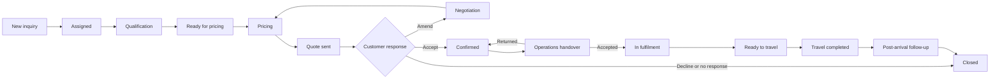

# TravelSync Full Lead Workflow Specification

**Status:** Product design baseline  
**Version:** 1.0  
**Date:** 14 August 2026  
**Related:** [Role-by-Role Workflow Specification](ROLE_WORKFLOW_SPECIFICATION.md) · [Information Architecture Specification](INFORMATION_ARCHITECTURE_SPECIFICATION.md) · [Target Data Model](TARGET_DATA_MODEL_SPECIFICATION.md) · [Workflow Engine](WORKFLOW_ENGINE_SPECIFICATION.md)

## 1. Purpose

This document defines the complete lifecycle of a TravelSync lead, from first customer contact through sales, confirmation, fulfilment, travel, post-arrival follow-up, and closure.

It replaces an unrestricted status dropdown with controlled business actions, validation gates, ownership rules, tasks, automation, and audit events.

## 2. Design principles

1. A lead always shows its owner, stage, health, and next action.
2. A stage describes business progress; it does not describe a team, payment status, or individual service status.
3. Stage changes happen through named actions with validation, not direct status editing.
4. Sales owns the commercial relationship; Operations owns fulfilment after handover.
5. Financial and operational state remain independent but visible in the same workspace.
6. Handoffs are explicit contracts that can be accepted or returned for correction.
7. Every active lead has at least one open next-action task.
8. Exceptions are visible and auditable; they do not silently bypass gates.
9. Closing requires a structured outcome and reason.
10. Historical events are immutable from the normal UI.

## 3. Lead workspace model

Every lead opens in one unified workspace.

### 3.1 Header

- Lead/booking reference
- Customer name
- Product type
- Current lifecycle stage
- Health: on track, attention, at risk, blocked
- Sales owner
- Operations owner when applicable
- Travel dates
- Next action and due time
- Primary action button for the current stage

### 3.2 Workspace sections

1. **Overview** — essential customer and travel summary.
2. **Conversation** — WhatsApp and recorded contact history.
3. **Requirements** — structured qualification and travel needs.
4. **Quotes** — versions, commercial terms, send/acceptance history.
5. **Operations** — services, documents, supplier references, exceptions.
6. **Finance** — invoices, receipts, balances, bills, payments, margin.
7. **Tasks** — next actions, due dates, owners, dependencies.
8. **Files** — passports, confirmations, PDFs, and supporting documents.
9. **Timeline** — complete cross-functional audit history.

## 4. Independent state dimensions

The redesign must not overload one `status` field with unrelated concepts.

### 4.1 Lifecycle stage

- New inquiry
- Assigned
- Qualification
- Ready for pricing
- Pricing
- Quote sent
- Negotiation
- Confirmed
- Operations handover
- In fulfilment
- Ready to travel
- Travel completed
- Closed

### 4.2 Ownership

- Sales owner
- Operations owner
- Call-centre assignee per call task
- Collaborators
- Manager/escalation owner

### 4.3 Commercial state

- No quote
- Quote draft
- Quote ready
- Quote sent
- Amendment requested
- Quote accepted
- Quote expired
- Quote declined

### 4.4 Customer payment state

- Not invoiced
- Unpaid
- Partially paid
- Paid
- Overpaid
- Refunded/partially refunded
- Payment exception

### 4.5 Operations state

- Handover not started
- Handover submitted
- Handover returned
- Handover accepted
- In progress
- Ready with exceptions
- Ready
- Completed

### 4.6 Individual service state

Applied independently to air, hotel, visa, land package, cruise, transfers, insurance, activities, and custom services:

- Not required
- Pending
- In progress
- Awaiting customer
- Awaiting supplier
- Done
- Exception
- Cancelled

### 4.7 Document state

- Not required
- Required
- Requested
- Received
- Verified
- Rejected/replacement required
- Complete

### 4.8 Lead health

Health is derived, not manually selected:

- **On track:** no overdue mandatory task or active blocking exception.
- **Attention:** due within threshold, awaiting external response, or incomplete gate data.
- **At risk:** overdue task, approaching departure with incomplete service, overdue balance, or stale customer follow-up.
- **Blocked:** explicit dependency prevents progress.

## 5. Lead types

Lead type changes requirements and workflows without creating separate applications.

### Standard individual

Default travel inquiry workflow.

### Group

- Must include group size and group context.
- Must link to Tour Master before confirmation.
- Capacity and booked passenger count must be visible.
- Finance rolls up to tour-level profitability and cash gap.

### Cruise

- Captures cruise line, ship, sailing, cabin, embarkation, and disembarkation.
- Cruise and group flags are mutually exclusive unless the future model explicitly supports group cruise bookings.

### Visa-focused

- Visa requirements and document workflow become primary.
- It still uses the standard commercial and ownership model.

### Other lead

Used for lightweight ticket, hotel, or miscellaneous work. It may use the simplified lifecycle in section 23 while retaining tasks, finance, attachments, and audit history.

## 6. End-to-end workflow



## 7. Stage 1 — New inquiry

### Meaning

An inquiry exists but no sales user has accepted accountability.

### Entry sources

- WhatsApp inbound conversation
- Manual entry by Marketing, Sales, or Admin
- Future web form, email, referral, phone, social, or import

### System actions on entry

- Generate reference ID.
- Store source timestamp and attribution.
- Link to or create the contact/customer candidate.
- Run duplicate detection.
- Place in the Sales Intake queue.
- Start first-assignment SLA.
- Create an audit event.

### Minimum creation data

- Source
- Original message or inquiry summary
- At least one contact identifier, when supplied
- Customer/display name or anonymous-contact label
- Created-by/source identity

### Available actions

- Assign to me
- Assign to sales user
- Merge duplicate
- Mark invalid/spam
- Request intake correction

### Exit gate

To move to **Assigned**:

- One active sales owner is selected.
- The record is not an unresolved duplicate.
- Contact information is usable or explicitly marked unavailable.

### Automation

- Notify Sales intake/manager if unassigned beyond target.
- Escalate high-priority inquiries faster.
- Preserve WhatsApp ad attribution on lead conversion.

## 8. Stage 2 — Assigned

### Meaning

A sales owner accepted the inquiry but qualification has not formally started.

### Entry action

**Accept inquiry** or **Assign inquiry**.

### System actions

- Set sales owner and assignment timestamp.
- Notify new owner.
- Notify previous owner on reassignment.
- Create first-contact task.
- Start first-response SLA.

### Available actions

- Start qualification
- Log contact attempt
- Reassign
- Return to intake
- Close invalid/duplicate

### Exit gate

To move to **Qualification**:

- Sales owner reviewed the inquiry.
- A first-contact attempt or active customer conversation exists.

## 9. Stage 3 — Qualification

### Meaning

Sales is establishing whether the inquiry is real, actionable, and sufficiently understood.

### Qualification checklist

#### Customer

- Full/display name
- Preferred contact method
- Phone/WhatsApp/email
- Preferred contact time
- Existing customer match

#### Travel intent

- Product type
- Destination/country
- Departure origin where applicable
- Travel start and end dates or flexible range
- Duration
- Adults, children, infants
- Child ages where pricing depends on them
- Purpose of travel

#### Requirements

- Air ticket requirement
- Hotel requirement and standard
- Visa requirement and nationality
- Land package/transfers
- Cruise details where applicable
- Insurance or activities
- Special requests/accessibility

#### Commercial context

- Budget or expected range where available
- Decision deadline
- Competing options where disclosed
- Payment expectations

### Contact attempt model

Each attempt records:

- Channel
- Timestamp
- Outcome
- Notes
- Next contact time
- Actor

Supported outcomes:

- Connected
- No answer
- Message sent
- Requested callback
- Wrong contact
- Not interested
- Invalid inquiry

### Available actions

- Save qualification progress
- Complete qualification
- Schedule follow-up
- Request customer information
- Change product type
- Close lead

### Exit gate

To move to **Ready for pricing**, required fields depend on product type but must include:

- Customer contactability
- Destination/product
- Travel dates or explicit flexibility
- Passenger count
- Required services
- Sufficient notes for pricing
- Decision/follow-up date

### Stale-lead automation

- Warn when no activity occurs within configured time.
- Escalate repeated missed follow-ups.
- After the configured no-response sequence, offer **Close as no response**; do not auto-close without policy approval.

## 10. Stage 4 — Ready for pricing

### Meaning

Qualification is complete and pricing can begin without guessing essential requirements.

### Entry action

**Complete qualification**.

### System actions

- Freeze a qualification snapshot for audit.
- Create pricing task.
- Record qualification completion time.
- Notify relevant pricing collaborator if one exists.

### Available actions

- Start pricing
- Return to qualification
- Add collaborator
- Request rate
- Close lead

### Return rule

Returning to Qualification requires a reason such as missing information, customer change, or invalid assumption.

## 11. Stage 5 — Pricing

### Meaning

The itinerary and commercial offer are being assembled.

### Pricing workflow

1. Review qualification snapshot.
2. Request supplier/internal rates where needed.
3. Build services and line items.
4. Record cost assumptions where authorized.
5. Calculate selling price and expected margin.
6. Define validity, payment, cancellation, inclusion, and exclusion terms.
7. Review quote completeness.
8. Mark quote ready.

### Quote requirements

- Quote number and version
- Lead/customer
- Quote date and validity
- Subject/itinerary summary
- Line items with quantity, rate, and amount
- Currency
- Inclusions and exclusions
- Payment terms
- Cancellation/other terms
- Notes and assumptions
- Total amount

### Controls

- Only one current quote version can be sendable.
- Sent quote versions become immutable; amendment creates a new version.
- Margin below threshold requires manager approval.
- Expired quotes cannot be accepted without renewal or override.
- Customer price changes are audited.

### Available actions

- Save draft
- Request rate
- Submit for approval
- Mark quote ready
- Return to qualification
- Close lead

### Exit gate

To send a quote:

- Required quote fields are complete.
- Total is calculated.
- Approval is present where required.
- Valid-until date is in the future.
- Recipient/channel is valid.

## 12. Stage 6 — Quote sent

### Meaning

A versioned proposal was delivered and a customer decision is pending.

### Entry action

**Send quote**.

### System actions

- Generate/store final PDF.
- Record quote version, channel, recipient, sender, and timestamp.
- Lock sent version.
- Set next follow-up date.
- Create customer-follow-up task.
- Start quote-response timer.

### Available actions

- Record customer response
- Send reminder
- Resend current quote
- Start amendment
- Confirm acceptance
- Mark declined
- Close no response

### Customer response outcomes

- Accepted
- Amendment requested
- Considering/follow-up scheduled
- Declined—price
- Declined—dates
- Declined—service/product
- Booked elsewhere
- No response
- Other

### Expiry behavior

- Warn owner before expiry.
- Mark commercial state expired after validity ends.
- Prevent direct acceptance until renewed or explicitly overridden.
- Keep lifecycle in Quote sent/Negotiation until an action is taken.

## 13. Stage 7 — Negotiation / amendment

### Meaning

The customer requested a change or a commercial decision remains active.

### Entry action

**Start amendment** or **Record negotiation**.

### Required amendment data

- Requested change
- Request source and timestamp
- Customer deadline
- Affected quote version
- Owner and due time

### Workflow

1. Capture change request.
2. Determine whether requalification is required.
3. Clone prior quote into a new draft version.
4. Update affected services and prices.
5. Obtain required approvals.
6. Send new version.
7. Supersede prior active version without deleting it.

### Exit paths

- New version sent → Quote sent
- Customer accepts current valid version → Confirmed
- Customer declines/no response → Closed
- Material requirements missing → Qualification

## 14. Stage 8 — Confirmed

### Meaning

The customer accepted a valid commercial proposal and confirmation policy is satisfied.

### Entry action

**Confirm booking**.

### Confirmation gate

- Accepted quote version is identified.
- Acceptance evidence/channel/time is recorded.
- Customer identity and contact details are sufficient.
- Dates, passenger counts, and core itinerary are confirmed.
- Required deposit is recorded, or an approved finance exception exists.
- Payment and cancellation terms were provided.
- Material promises are recorded.
- Group lead is linked to a Tour Master.
- No blocking quote approval remains.

### System actions

- Assign/create booking reference if distinct from lead reference.
- Mark quote accepted/converted as appropriate.
- Create or propose invoice.
- Preserve confirmed commercial snapshot.
- Create operations handover checklist.
- Request Operations owner assignment.
- Notify Sales, Operations queue, and Accounts where appropriate.
- Start handover SLA.

### Available actions

- Prepare handover
- Assign Operations owner
- Request invoice
- Record customer change
- Cancel booking
- Reopen confirmation exception

### Post-confirmation change control

Customer changes after confirmation must not overwrite the confirmed snapshot. They create a change request containing:

- Requested change
- Commercial impact
- Operational impact
- Supplier/cancellation impact
- Customer approval
- Required internal approvals
- Revised documents

## 15. Stage 9 — Operations handover

### Meaning

Sales has submitted a confirmed booking for Operations review.

### Handover package

- Confirmed quote/version and PDF
- Customer and passenger information
- Travel dates and itinerary
- Included/excluded services
- Payment/deposit summary
- Supplier holds or assumptions
- Visa/document requirements
- Special requests and accessibility needs
- Customer promises and deadlines
- Conversation highlights
- Attachments
- Known risks or exceptions

### Sales action

**Submit handover**.

### Operations decisions

- Accept
- Return for correction
- Escalate feasibility/commercial exception

### Return reasons

- Quote missing/inconsistent
- Passenger data incomplete
- Itinerary unclear
- Payment evidence/exception missing
- Inclusion or customer promise unclear
- Passport/visa information missing
- Supplier feasibility concern
- Group tour not linked
- Other with explanation

### Rules

- Returned handover creates a Sales correction task.
- Confirmation is not erased by return.
- Sales resubmits after correction.
- Acceptance records Operations owner and timestamp.

### Exit gate

To **In fulfilment**:

- Operations owner is assigned.
- Handover is accepted.
- Mandatory service checklist is generated.
- Major known exceptions have owners.

## 16. Stage 10 — In fulfilment

### Meaning

Operations is arranging all confirmed services and documents.

### Service record requirements

Each required service contains:

- Type
- Description
- Owner
- Supplier
- Status
- Due date
- Booking/reference number
- Cost/commitment link where authorized
- Customer-facing inclusion
- Documents/attachments
- Exception state

### Operational workflow

1. Validate services against confirmed quote.
2. Assign service owners and due dates.
3. Book/request services.
4. Store confirmations and supplier deadlines.
5. Collect and verify customer documents.
6. Raise cost or feasibility exceptions.
7. Resolve cross-team dependencies.
8. Perform readiness checks as departure approaches.

### Dependency routing

- Missing customer information → Sales task
- Customer payment risk → Accounts task
- Supplier payment needed → Accounts task
- Customer-requested scope change → Sales change request
- Policy/approval issue → Manager/Admin exception

### Operations completion gate

To **Ready to travel**:

- Every mandatory service is Done, Not required, or covered by an approved exception.
- Required documents are verified.
- Final itinerary exists.
- Supplier references are stored.
- Finance clearance or approved exception exists.
- Emergency/customer contact details are present.
- Unresolved risks are explicitly acknowledged.

## 17. Stage 11 — Ready to travel

### Meaning

Mandatory fulfilment is complete and the booking can enter departure assurance.

### Entry action

**Mark ready to travel** after a readiness review.

### System actions

- Record readiness snapshot and reviewer.
- Generate pre-departure call when within configured window.
- Notify Sales and Call Centre.
- Monitor changes after readiness.

### Pre-departure call checklist

- Customer reached/attempted according to policy
- Itinerary received
- Air/hotel/land confirmations understood
- Visa/documents received where applicable
- Transfer/meeting information understood
- Emergency contact shared
- Outstanding issue captured

### Change-after-readiness rule

Any material change reopens the affected readiness check and marks health at least Attention until revalidated.

### Exit

- Travel dates pass and no blocking departure issue remains → Travel completed
- Booking cancelled → Closed with post-confirmation cancellation process

## 18. Stage 12 — Travel completed

### Meaning

The itinerary end/arrival date has passed and final follow-up/reconciliation is pending.

### System actions

- Generate post-arrival call after configured interval.
- Create operational completion/reconciliation tasks where needed.
- Notify Sales of future-opportunity or complaint outcomes.

### Post-arrival outcomes

- Completed—satisfied/no issue
- Service issue
- Complaint
- Refund/compensation requested
- Future inquiry/opportunity
- Customer unreachable
- Did not travel/cancelled

### Exit gate

To close as completed:

- Required post-arrival attempts are complete.
- Customer issues have owners or are resolved.
- Operational service records are complete.
- Required finance reconciliation is complete or separately tracked under an approved exception.

## 19. Stage 13 — Closed

### Meaning

No normal lead workflow work remains.

### Closure categories

#### Successful

- Booked and travel completed
- Other service completed

#### Lost before confirmation

- Customer declined
- No response
- Price not accepted
- Dates unavailable
- Service unavailable
- Booked elsewhere

#### Administrative

- Duplicate/merged
- Invalid/spam
- Created in error

#### Cancelled

- Cancelled before confirmation
- Cancelled after confirmation
- Supplier/company cancellation

### Closure requirements

- Category and reason
- Closure note
- Actor and timestamp
- Current open tasks resolved/cancelled/reassigned
- Financial and operational consequences acknowledged
- Linked destination record for merged duplicates

### System actions

- Stop normal SLA timers.
- Cancel or resolve nonessential future tasks.
- Preserve record and audit history.
- Remove from active queues.
- Keep searchable according to permission.

### Reopen rules

- Sales Manager or Admin may reopen pre-confirmation lost leads.
- Operations/Accounts implications must be reviewed for confirmed/cancelled bookings.
- Reopen requires reason, target stage, owner, and next task.
- Reopen never deletes closure history.

## 20. Cancellation workflow

Cancellation is an action, not a generic status shortcut.

### Before confirmation

1. Record initiator and reason.
2. Close open quote/commercial tasks.
3. Mark relevant quote declined/withdrawn.
4. Close lead under pre-confirmation cancellation.

### After confirmation

1. Create cancellation case.
2. Freeze current operational and financial snapshot.
3. Identify cancellable/non-refundable services.
4. Obtain supplier cancellation terms.
5. Calculate customer refund or balance.
6. Obtain approvals where required.
7. Communicate outcome to customer.
8. Reverse/cancel services with evidence.
9. Process finance entries.
10. Close only when accountable cancellation tasks are complete or approved exceptions exist.

## 21. Duplicate and merge workflow

### Detection signals

- Same phone/WhatsApp ID/email
- Same customer and overlapping dates/destination
- Same Meta click/ad identifiers
- Same original message within a short interval

### Merge rules

- User reviews both records; no automatic destructive merge.
- Select one surviving lead.
- Move or link conversations, notes, tasks, and attachments.
- Financial records require special validation and are not blindly moved.
- Losing record closes as Duplicate/Merged and links to survivor.
- Audit timeline records source, destination, actor, and reason.

## 22. Archival workflow

Archive is a visibility/storage state, not a lifecycle outcome.

- Only closed leads should normally be archived.
- Archiving requires permission and retains all relations.
- Archived leads are excluded from active queues and default search.
- Restore returns the lead to Closed unless an authorized Reopen action is also performed.
- Archive and restore events are audited.

## 23. Simplified Other Lead workflow

Other Leads use a reduced flow for lightweight services:

```text
Draft → Confirmed → Completed
```

### Draft

- Capture customer, contact, summary, dates, and details.
- Create quote if needed after sufficient information is present.

### Confirmed

- Requires customer agreement and sufficient commercial evidence.
- May create quote and invoice.
- Creates service tasks appropriate to the record.

### Completed

- Requires service completion and resolution of mandatory tasks.
- Finance may remain visible for reconciliation.

Other Leads must still support owners, tasks, conversation, attachments, finance, closure reason, and audit history.

## 24. Task automation matrix

| Trigger | Task | Default owner |
|---|---|---|
| Inquiry created | Assign inquiry | Sales intake/manager |
| Sales assigned | First contact | Sales owner |
| Qualification started | Complete requirements | Sales owner |
| Qualification completed | Prepare pricing | Sales owner/pricing collaborator |
| Quote sent | Customer follow-up | Sales owner |
| Quote nearing expiry | Renew or close | Sales owner |
| Booking confirmed | Complete handover | Sales owner |
| Handover submitted | Review handover | Operations owner/queue |
| Handover returned | Correct handover | Sales owner |
| Handover accepted | Complete service plan | Operations owner |
| Customer data missing | Obtain information | Sales owner |
| Customer payment due | Collect/reconcile payment | Accounts with Sales visibility |
| Supplier payment needed | Review/pay supplier | Accounts |
| Service deadline approaching | Complete service | Operations owner |
| Ready-to-travel window | Perform readiness review | Operations owner |
| Pre-departure window opens | Call customer | Call Centre |
| Return date passes | Post-arrival call | Call Centre |
| Issue raised in call | Resolve issue | Sales/Operations/Accounts by issue type |

## 25. Notification matrix

### Sales owner

- Lead assigned/reassigned
- Customer inbound message
- Follow-up due/overdue
- Quote expiring
- Handover returned
- Operations/customer issue requiring Sales
- Payment issue affecting customer communication

### Operations owner

- Handover assigned/submitted
- Customer/sales change request
- Service due/overdue
- Supplier or payment issue affecting fulfilment
- Pre-departure call issue

### Accounts

- Booking requires invoice
- Customer payment submitted/unmatched
- Vendor bill submitted
- Supplier payment due
- Finance hold or exception

### Call Centre

- Call assigned
- Call due/retry due
- Escalated issue resolved and customer callback needed

### Managers

- Unassigned/overdue work beyond threshold
- Handoff rejection ageing
- Margin/exception approval
- Departure-at-risk booking
- Repeated SLA breach

## 26. SLA framework

SLA values should be configurable rather than hard-coded.

Track at least:

- Inquiry-to-assignment
- Assignment-to-first-contact
- Qualification duration
- Pricing turnaround
- Quote follow-up adherence
- Confirmation-to-handover submission
- Handover review time
- Service completion against due date
- Ready-to-travel threshold
- Call completion window
- Cross-team escalation acknowledgement/resolution

SLA timers pause only for an explicit waiting reason such as awaiting customer, supplier, or approved internal dependency. Pause reason and expected response date are mandatory.

## 27. Permission and ownership rules

### Sales

- Can manage assigned or explicitly shared leads.
- Can claim eligible unassigned inquiries.
- Can create and revise quotes according to permissions.
- Cannot edit accounting source-of-truth entries.

### Operations

- Can manage assigned bookings after handover.
- Can view commercial and finance context required for fulfilment.
- Cannot change accepted customer price.

### Accounts

- Can manage invoices, receipts, vendor bills, and supplier payments.
- Can view all necessary booking context.
- Cannot change qualification or operational evidence.

### Call Centre

- Can view booking context for assigned calls.
- Can record call attempts and escalate.
- Cannot edit core lead, operations, or finance data.

### Managers

- Can see and reassign records within their same-role team.
- Do not automatically receive cross-functional edit rights.

### Admin

- Can perform privileged correction with reason and audit.
- Should return routine business work to its accountable role.

## 28. Audit event catalogue

- Lead created
- Source attribution captured/changed
- Duplicate flagged/cleared/merged
- Sales assigned/reassigned
- First contact and later attempts
- Qualification field/checklist completed
- Stage entered/exited
- Task created/completed/rescheduled/reassigned
- Quote drafted/versioned/approved/sent/expired/accepted/declined/converted
- Booking confirmed
- Operations owner assigned
- Handover submitted/accepted/returned
- Service state changed
- Document requested/received/verified/rejected
- Invoice created/updated
- Customer payment recorded/reversed/adjusted
- Vendor bill created/updated
- Supplier payment recorded/reversed/adjusted
- Readiness reviewed
- Call assigned/attempted/completed
- Exception opened/approved/rejected/resolved
- Booking cancelled
- Lead closed/reopened
- Lead archived/restored/deleted where allowed

Each event stores actor, timestamp, event type, description, previous state, new state, reason, and related record references.

## 29. Existing-status migration map

| Current status | Proposed lifecycle stage | Notes |
|---|---|---|
| `new` | New inquiry | Preserve unassigned state separately. |
| `assigned_to_sales` | Assigned or Qualification | Determine using contact/qualification activity. |
| `info_gather_complete` | Ready for pricing | Rename in UI. |
| `rate_requested` | Pricing | Rate request becomes a pricing task/substate. |
| `pricing_in_progress` | Pricing | Direct mapping. |
| `sent_to_customer` | Quote sent | Requires a linked sent quote/version where possible. |
| `amendment` | Negotiation | Amendment becomes quote/change-request state. |
| `confirmed` | Confirmed or Operations handover | Determine using handover/operations evidence. |
| `assigned_to_operations` | Operations handover or In fulfilment | Assignment is ownership, not lifecycle. |
| `operation_complete` | Ready to travel or Travel completed | Determine using dates and service readiness. |
| `document_upload_complete` | Ready to travel | Document status should remain independent. |
| `mark_completed` | Closed—successful | Require migration closure reason. |
| `mark_closed` | Closed | Backfill closure reason where possible. |

## 30. Required data-model changes

Recommended additions or replacements:

- `lifecycle_stage`
- `sales_owner_id`
- `operations_owner_id`
- `lead_type`
- `health_state` or derived health service
- `next_action_at`
- `waiting_reason` and `waiting_until`
- `closed_at`, `closed_by`, `closure_category`, `closure_reason`
- `confirmed_at`, `confirmed_by`, `accepted_quote_id`
- Handoff records with version, submitted/accepted/returned timestamps and reasons
- Generic task records with owner, due date, priority, dependency, outcome
- Quote version and send-history records
- Service items instead of only four fixed service columns
- Document requirement/checklist records
- Structured workflow events or expanded action logs
- Exception/approval records

Keep compatibility fields during migration, but make the new workflow service the only writer after rollout.

## 31. Workflow engine requirements

A central workflow service should:

- Return actions available to the current actor for a lead.
- Validate transition permissions and gates.
- Apply transitions transactionally.
- Create/cancel tasks and notifications.
- Record audit events.
- Prevent invalid direct status mutation.
- Support approved overrides with reason.
- Expose the same rules to Filament UI, controllers, jobs, APIs, tests, and future mobile interfaces.

Conceptual API:

```php
$workflow->availableActions($lead, $user);
$workflow->can($lead, LeadAction::ConfirmBooking, $user);
$workflow->execute($lead, LeadAction::ConfirmBooking, $user, $payload);
```

## 32. Lead-list and board views

Replace duplicated lead resources with saved views over one workflow source:

- Unassigned inquiries
- My active leads
- Qualification due
- Pricing queue
- Quotes awaiting customer
- Amendments
- Confirmed awaiting handover
- Handover returned
- Active operations
- Departing soon
- Visa/document risk
- Group bookings
- Cruise bookings
- Closed leads
- Archived leads

Views may be table, board, or calendar presentations, but opening any record leads to the same workspace.

## 33. Reporting definitions

### Funnel

- Created inquiries
- Assigned inquiries
- Qualified inquiries
- Quotes sent
- Confirmed bookings
- Completed bookings

### Conversion

- Inquiry-to-qualified
- Qualified-to-quoted
- Quote-to-confirmed
- Inquiry-to-confirmed

### Velocity

- Median time per stage
- Age of current stage
- End-to-end confirmation cycle
- Confirmation-to-ready-to-travel

### Quality

- Handoff first-pass acceptance
- Requalification/amendment count
- Overdue-task rate
- Reopen rate
- Cancellation and closure reason distribution
- Departure-at-risk incidence

Stage metrics must derive from workflow events, not only the current lead status.

## 34. Acceptance criteria

The full lead workflow is complete when:

1. Users cannot arbitrarily select any lead status.
2. Available actions depend on stage, permission, ownership, and required data.
3. Every active lead has an owner or is visibly queued for assignment.
4. Every active lead has a next action with an owner and due time.
5. Sent quote versions are immutable and amendments are versioned.
6. Confirmation requires a valid accepted quote and defined confirmation evidence.
7. Group confirmations require a Tour Master link.
8. Sales-to-Operations handoff supports submit, accept, return, correct, and resubmit.
9. Service, document, commercial, payment, and lifecycle states are independent.
10. Ready-to-travel requires operational, document, and finance checks or approved exceptions.
11. Departure and arrival calls are created from dates and readiness rules.
12. Closure requires structured outcome and reason.
13. Reopen preserves closure history and creates new work.
14. All meaningful actions appear in one audit timeline.
15. All role views open the same canonical lead workspace.

## 35. Suggested delivery sequence

### Phase 1 — Foundation

- Add canonical lifecycle and transition service.
- Add tasks, closure reasons, waiting reasons, and workflow events.
- Map existing statuses.

### Phase 2 — Sales

- Build intake, qualification, pricing, quote-send, follow-up, and confirmation gates.
- Introduce quote versions.

### Phase 3 — Handover and Operations

- Add handoff records, service items, documents, readiness, and exception handling.

### Phase 4 — Finance and Call Centre integration

- Connect financial clearance, supplier dependencies, pre-departure calls, and post-arrival calls.

### Phase 5 — Consolidated UI and reporting

- Replace duplicate Filament resources with saved views and the unified workspace.
- Rebuild analytics from workflow events.

### Phase 6 — Migration and enforcement

- Backfill lifecycle stages and closure reasons.
- Run old/new workflow in comparison mode.
- Disable direct legacy status writes.
- Retire duplicated resources and obsolete status logic.
