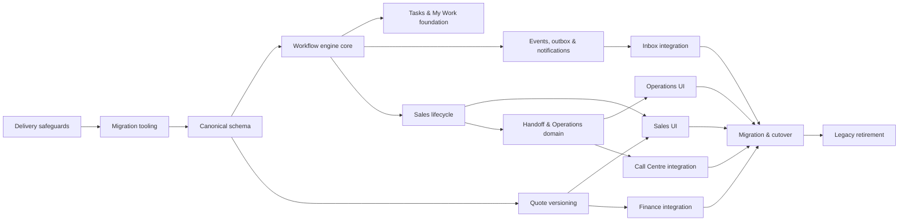

# TravelSync Redesign Implementation Backlog

**Status:** Delivery planning baseline  
**Version:** 1.0  
**Date:** 25 August 2026  
**Related:** [Target Data Model](TARGET_DATA_MODEL_SPECIFICATION.md) · [Workflow Engine](WORKFLOW_ENGINE_SPECIFICATION.md) · [Migration Plan](EXISTING_SYSTEM_MIGRATION_PLAN.md) · [Information Architecture](INFORMATION_ARCHITECTURE_SPECIFICATION.md)

## 1. Purpose

This backlog converts the approved TravelSync workflows, information architecture, wireframes, target data model, workflow engine, and migration plan into implementable delivery work.

It is organized for incremental rollout. Each milestone must leave the production application operational and recoverable.

## 2. Backlog conventions

### Priority

- **P0:** Required for data safety, workflow integrity, or milestone release
- **P1:** Required for intended business operation
- **P2:** Valuable improvement that may follow the initial cutover
- **P3:** Future enhancement

### Size

Relative delivery size, not elapsed time:

- **S:** Small, isolated change
- **M:** Moderate change with several tests/integrations
- **L:** Large cross-layer feature
- **XL:** Must be split before active development

### Story status

- Proposed
- Ready
- In progress
- In review
- Done
- Blocked

### Definition of ready

A story is Ready only when:

- Business outcome is clear.
- Dependencies are Done or explicitly mocked.
- Data/permission impact is identified.
- Acceptance criteria are testable.
- Migration/rollback impact is documented.
- Required UI state is represented in approved wireframes or design notes.

### Definition of done

A story is Done only when:

- Acceptance criteria pass.
- Unit/feature/integration tests pass.
- Authorization is tested.
- Audit/events and observability are included where applicable.
- Migration is idempotent and rehearsed where applicable.
- Documentation/runbooks are updated.
- Accessibility and responsive behavior are verified for UI work.
- Feature flags default safely.
- No unrelated user changes are overwritten.

## 3. Release milestones

| Milestone | Outcome | Included epics |
|---|---|---|
| M0 — Safety foundation | Rollout controls, migration tracking, production baseline | E00–E01 |
| M1 — Workflow foundation | Canonical schema, engine core, events, outbox, tasks | E02–E05 |
| M2 — Sales pilot | Controlled Sales lifecycle, quote versions, Lead Workspace, Pipeline | E06–E08 |
| M3 — Operations pilot | Handoffs, services, documents, readiness, Operations UI | E09–E10 |
| M4 — Cross-functional operation | Inbox, Finance, Call Centre integration | E11–E13 |
| M5 — Global cutover | Reconciliation, role rollout, canonical reads/writes | E14 |
| M6 — Legacy retirement | Redirects, observer/resource retirement, contract migration | E15 |

## 4. Dependency overview



## 5. Epic E00 — Delivery safeguards and decisions

**Outcome:** The team can change the system safely with agreed policies and measurable rollout controls.

| ID | Story | Priority | Size | Dependencies |
|---|---|---:|:---:|---|
| E00-S01 | Confirm target data-model decisions | P0 | M | None |
| E00-S02 | Implement server-side feature flags | P0 | M | None |
| E00-S03 | Capture current production baseline | P0 | M | None |
| E00-S04 | Inventory all lifecycle and ownership writers | P0 | M | None |
| E00-S05 | Verify backup and restore runbook | P0 | M | None |
| E00-S06 | Establish workflow observability baseline | P1 | M | E00-S03 |

### E00-S01 — Confirm target data-model decisions

Decide and record:

- One or multiple quote series per lead
- Required task due-date policy
- Traveller/passenger model scope
- Service-cost source of truth
- Code versus configurable workflow templates
- Approval thresholds
- Retention periods/ownership
- Live versus projected health calculation
- Production database/index capabilities
- Legacy action-log retention

**Acceptance criteria**

- All ten decisions have named business and technical approvers.
- Decisions are reflected in relevant specifications.
- No planned migration depends on an unresolved decision.

### E00-S02 — Implement server-side feature flags

**Acceptance criteria**

- Flags support environment, user, role, and named pilot group targeting.
- Write-path flags are deterministic for a user/lead.
- Safe defaults keep new writes and UIs disabled.
- Admin-only diagnostics show effective flag values.
- Tests cover enabled, disabled, and targeted behavior.

### E00-S03 — Capture production baseline

**Acceptance criteria**

- Row counts, status distributions, role distributions, finance totals, queue health, and reference uniqueness are recorded.
- Report contains no unnecessary sensitive data.
- Baseline is versioned with date and application commit.

### E00-S04 — Inventory direct writers

**Acceptance criteria**

- Every write to lead status, owners, type flags, service fields, quote state, and assignment is identified.
- Each writer has a target workflow action or explicit retirement plan.
- CI can detect newly introduced direct writers in protected paths.

### E00-S05 — Backup/restore rehearsal

**Acceptance criteria**

- A backup is restored into an isolated environment.
- Application boots and critical row counts/totals match.
- Recovery time and responsible operators are documented.

## 6. Epic E01 — Migration tooling and data audit

**Outcome:** Backfills are resumable, idempotent, observable, and independently reconcilable.

| ID | Story | Priority | Size | Dependencies |
|---|---|---:|:---:|---|
| E01-S01 | Create migration run and issue tables | P0 | M | E00-S02 |
| E01-S02 | Build reusable resumable backfill framework | P0 | L | E01-S01 |
| E01-S03 | Build legacy-data audit command | P0 | L | E01-S02 |
| E01-S04 | Build reconciliation report framework | P0 | L | E01-S02 |
| E01-S05 | Create Admin migration-issue review queue | P1 | L | E01-S01, E01-S03 |
| E01-S06 | Add migration execution context | P0 | M | E01-S02 |

### E01-S01 — Migration tracking schema

**Acceptance criteria**

- Tables match the approved migration plan.
- Run progress, checkpoint, counts, options, failure, and issue severity are persisted.
- Migration records cannot accidentally trigger business notifications.

### E01-S02 — Backfill framework

**Acceptance criteria**

- Commands support dry-run, chunking, ID ranges, resume, limits, run IDs, and machine-readable output.
- Rerunning a completed chunk creates no duplicates.
- Interrupting and resuming is tested.
- Source maximum ID and delta pass are supported.

### E01-S03 — Legacy audit

**Acceptance criteria**

- Audits all anomalies listed in the migration plan.
- Issues use stable codes and severities.
- Critical findings can fail CI/staging cutover checks.
- Production-size execution is bounded and measured.

### E01-S04 — Reconciliation framework

**Acceptance criteria**

- Produces Lead, Quote, Operations, Task/Event, and Finance sections.
- Supports JSON and human-readable output.
- Numeric finance differences use exact decimal comparisons.
- Results link back to migration runs/issues.

## 7. Epic E02 — Canonical workflow data model

**Outcome:** Additive schema supports lifecycle, tasks, closures, exceptions, events, and reliable side effects.

| ID | Story | Priority | Size | Dependencies |
|---|---|---:|:---:|---|
| E02-S01 | Add canonical workflow columns to leads | P0 | L | E00-S01, E01-S03 |
| E02-S02 | Create task and dependency tables | P0 | M | E00-S01 |
| E02-S03 | Create workflow event table | P0 | M | E00-S01 |
| E02-S04 | Create workflow request/idempotency table | P0 | M | E00-S01 |
| E02-S05 | Create workflow outbox table | P0 | M | E00-S01 |
| E02-S06 | Create closure tables and seed reasons | P0 | M | E00-S01 |
| E02-S07 | Create exception and decision tables | P0 | M | E00-S01 |
| E02-S08 | Create collaborator table | P1 | S | E02-S01 |
| E02-S09 | Implement canonical enums and Eloquent models | P0 | L | E02-S01–S08 |
| E02-S10 | Add target indexes and schema invariant tests | P0 | M | E02-S01–S09 |

### E02-S01 — Canonical lead columns

**Acceptance criteria**

- Columns are additive and nullable/defaulted for backward compatibility.
- Existing lead writes remain functional with flags off.
- Index creation is safe for the production database.
- No large data backfill runs inside the schema migration.

### E02-S09 — Models and enums

**Acceptance criteria**

- Models, relationships, casts, factories, and enum values match the target specification.
- New models do not expose unrestricted mass assignment for lifecycle-sensitive fields.
- Workflow events reject update/delete through normal model APIs.

## 8. Epic E03 — Workflow engine core

**Outcome:** One service safely queries and executes named workflow actions.

| ID | Story | Priority | Size | Dependencies |
|---|---|---:|:---:|---|
| E03-S01 | Implement workflow DTOs and action enum | P0 | M | E02-S09 |
| E03-S02 | Implement action registry | P0 | M | E03-S01 |
| E03-S03 | Implement workflow authorization service | P0 | L | E03-S01 |
| E03-S04 | Implement gate contract and runner | P0 | M | E03-S01 |
| E03-S05 | Implement transactional engine orchestration | P0 | L | E03-S02–S04 |
| E03-S06 | Implement optimistic/pessimistic concurrency | P0 | M | E03-S05 |
| E03-S07 | Implement idempotent request handling | P0 | M | E02-S04, E03-S05 |
| E03-S08 | Implement available-actions query | P0 | L | E03-S02–S04 |
| E03-S09 | Implement direct-write detector | P0 | M | E03-S05 |
| E03-S10 | Generate transition contract tests from registry | P0 | L | E03-S02, E03-S05 |

### E03-S05 — Transactional engine

**Acceptance criteria**

- Engine locks, authorizes, evaluates gates, invokes handler, applies task plan, appends events/outbox, and records idempotent result in one transaction.
- Failure at any pre-commit step rolls back all writes.
- External jobs/messages are not sent in the transaction.
- Result contains updated lock version and correlation ID.

### E03-S08 — Available actions

**Acceptance criteria**

- Returns available, blocked, and hidden actions correctly.
- Blockers use stable codes and safe role-aware messages.
- UI does not need to duplicate domain rules.

## 9. Epic E04 — Tasks, SLA, and My Work foundation

**Outcome:** Every active lead can produce owned, due, actionable work.

| ID | Story | Priority | Size | Dependencies |
|---|---|---:|:---:|---|
| E04-S01 | Implement task service and state transitions | P0 | L | E02-S02, E03-S05 |
| E04-S02 | Implement declarative workflow task planner | P0 | L | E04-S01 |
| E04-S03 | Implement task dependency validation | P1 | M | E04-S01 |
| E04-S04 | Implement SLA calculator | P0 | L | E00-S01, E04-S01 |
| E04-S05 | Implement waiting and SLA pause | P1 | M | E04-S04 |
| E04-S06 | Build current-task backfill command | P0 | L | E01-S02, E04-S02 |
| E04-S07 | Build lead workflow summary projection | P1 | L | E02-S09, E04-S01 |
| E04-S08 | Build My Work query service | P0 | L | E04-S07 |
| E04-S09 | Build My Work UI | P1 | L | E04-S08, E08-S01 |
| E04-S10 | Add reminders and overdue escalation jobs | P1 | M | E04-S04, E05-S04 |

### E04-S06 — Current task backfill

**Acceptance criteria**

- Creates only current required tasks.
- Uses deterministic automation keys.
- Produces no duplicate tasks on rerun.
- Sends no initial bulk notifications.
- Reconciliation detects missing or extra automated tasks.

## 10. Epic E05 — Events, outbox, notifications, and observability

**Outcome:** Business mutations are auditable and external effects are reliable.

| ID | Story | Priority | Size | Dependencies |
|---|---|---:|:---:|---|
| E05-S01 | Implement immutable workflow event writer | P0 | M | E02-S03, E03-S05 |
| E05-S02 | Implement event catalogue and payload versions | P0 | M | E05-S01 |
| E05-S03 | Implement transactional outbox writer | P0 | M | E02-S05, E03-S05 |
| E05-S04 | Implement outbox processor and retries | P0 | L | E05-S03 |
| E05-S05 | Implement semantic notification intents | P0 | L | E05-S04 |
| E05-S06 | Implement canonical route/deep-link resolver | P1 | M | E08-S01 |
| E05-S07 | Add notification deduplication | P0 | M | E05-S05 |
| E05-S08 | Build workflow timeline query/rendering service | P1 | L | E05-S01 |
| E05-S09 | Add engine/outbox metrics and structured logs | P0 | M | E03-S05, E05-S04 |
| E05-S10 | Build Admin System Health outbox view | P1 | M | E05-S04 |

### E05-S04 — Outbox processing

**Acceptance criteria**

- Processing is idempotent by message UUID.
- Retry/backoff and terminal failure are configurable.
- Failed items appear in System Health and can be safely retried.
- Business transactions remain committed when a side effect fails.

## 11. Epic E06 — Controlled Sales lifecycle

**Outcome:** Sales progresses leads through named actions and validated gates.

| ID | Story | Priority | Size | Dependencies |
|---|---|---:|:---:|---|
| E06-S01 | Implement assignment and claim actions | P0 | L | E03, E04, E05 |
| E06-S02 | Implement first-contact and qualification actions | P0 | L | E06-S01 |
| E06-S03 | Implement qualification checklist gates by lead type | P0 | L | E06-S02 |
| E06-S04 | Implement ready-for-pricing and pricing actions | P0 | M | E06-S03 |
| E06-S05 | Implement quote response and follow-up actions | P0 | L | E07-S08 |
| E06-S06 | Implement booking confirmation action and gates | P0 | L | E06-S05, E12-S02 |
| E06-S07 | Implement pre-confirmation closure and reopen | P0 | L | E02-S06, E03 |
| E06-S08 | Implement waiting/no-response sequence | P1 | M | E04-S05, E06-S05 |
| E06-S09 | Implement lead merge/duplicate workflow | P1 | L | E06-S01, E05-S01 |
| E06-S10 | Build Sales workflow feature test suite | P0 | L | E06-S01–S09 |

### E06-S06 — Confirm booking

**Acceptance criteria**

- Requires exact sent, current, valid quote version and recorded acceptance.
- Requires deposit evidence or matching approved exception.
- Requires Group Tour Master link.
- Creates handoff draft/task and invoice task.
- Cannot be duplicated through retry or concurrency.
- All mutations/events/tasks/outbox messages share a correlation ID.

## 12. Epic E07 — Quote versioning

**Outcome:** Sent proposals are immutable and amendments create traceable versions.

| ID | Story | Priority | Size | Dependencies |
|---|---|---:|:---:|---|
| E07-S01 | Create quote-series/version schema | P0 | L | E00-S01, E01-S03 |
| E07-S02 | Implement quote models, enums, and totals | P0 | L | E07-S01 |
| E07-S03 | Implement quote-version backfill | P0 | L | E01-S02, E07-S02 |
| E07-S04 | Implement quote reconciliation and PDF parity tests | P0 | L | E07-S03 |
| E07-S05 | Implement draft and amendment version service | P0 | L | E07-S02, E03 |
| E07-S06 | Implement quote approval flow | P1 | L | E07-S05, E02-S07 |
| E07-S07 | Implement quote readiness and snapshot locking | P0 | M | E07-S05 |
| E07-S08 | Implement quote delivery and responses | P0 | L | E05-S04, E07-S07 |
| E07-S09 | Migrate invoice relation to quote version | P0 | M | E07-S03 |
| E07-S10 | Enforce immutability and remove mutable send path | P0 | M | E07-S08, E14-S04 |

### E07-S04 — Reconciliation

**Acceptance criteria**

- Quote numbers, line items, totals, invoice relations, and PDFs match.
- Zero unresolved numeric discrepancies.
- Backfill is rerunnable and preserves legacy IDs in metadata.

## 13. Epic E08 — Global shell, Lead Workspace, and Sales UI

**Outcome:** The approved role-aware navigation and core Sales experience are usable.

| ID | Story | Priority | Size | Dependencies |
|---|---|---:|:---:|---|
| E08-S01 | Build design tokens and global application shell | P0 | L | Approved wireframes |
| E08-S02 | Build role-aware navigation service | P0 | L | E08-S01, E03-S03 |
| E08-S03 | Build global search foundation | P1 | L | E08-S01 |
| E08-S04 | Build unified Lead Workspace header and routing | P0 | L | E03-S08, E08-S01 |
| E08-S05 | Build Overview and Requirements tabs | P0 | L | E06-S03, E08-S04 |
| E08-S06 | Build Conversation, Quotes, Tasks, Files, Timeline tabs | P0 | XL | E05-S08, E07-S08, E11-S02 |
| E08-S07 | Build Operations and Finance summary tabs | P1 | L | E09-S05, E12-S04 |
| E08-S08 | Build contextual action forms and blocker UI | P0 | L | E03-S08, E08-S04 |
| E08-S09 | Build Sales Pipeline board and table | P0 | L | E06, E08-S04 |
| E08-S10 | Build saved-view/filter framework | P1 | L | E08-S09 |
| E08-S11 | Responsive and accessibility validation | P0 | M | E08-S01–S10 |

E08-S06 is XL and must be split by tab before implementation.

## 14. Epic E09 — Handoffs, services, documents, and readiness

**Outcome:** Confirmed bookings move through an explicit Operations workflow.

| ID | Story | Priority | Size | Dependencies |
|---|---|---:|:---:|---|
| E09-S01 | Create handoff schema/models | P0 | M | E02 |
| E09-S02 | Implement handoff preparation/submission | P0 | L | E06-S06, E09-S01 |
| E09-S03 | Implement handoff return/resubmit/accept | P0 | L | E09-S02 |
| E09-S04 | Create service-item schema/models | P0 | M | E02 |
| E09-S05 | Implement service workflow actions | P0 | L | E09-S04, E03 |
| E09-S06 | Create document requirement/submission schema | P0 | M | E09-S04 |
| E09-S07 | Generalize attachments with secure downloads | P0 | L | E09-S06 |
| E09-S08 | Implement document request/review/replacement actions | P0 | L | E09-S06, E09-S07 |
| E09-S09 | Implement readiness gate and review | P0 | L | E09-S05, E09-S08, E12-S02 |
| E09-S10 | Implement readiness revocation automation | P0 | L | E09-S09, E05-S04 |
| E09-S11 | Build service/document/handoff backfills | P0 | XL | E01, E09-S01, E09-S04, E09-S06 |
| E09-S12 | Build Operations workflow tests | P0 | L | E09-S01–S11 |

E09-S11 must be split into three independent backfill stories.

## 15. Epic E10 — Operations UI

**Outcome:** Operations users manage handovers, services, documents, exceptions, and readiness from approved screens.

| ID | Story | Priority | Size | Dependencies |
|---|---|---:|:---:|---|
| E10-S01 | Build Handover Queue | P0 | L | E09-S03, E08-S01 |
| E10-S02 | Build handoff review experience | P0 | L | E10-S01 |
| E10-S03 | Build Operations Board | P0 | L | E09-S05, E08-S10 |
| E10-S04 | Build service-item detail/actions | P0 | L | E09-S05 |
| E10-S05 | Build Documents queue and verification UI | P0 | L | E09-S08 |
| E10-S06 | Build Departing Soon/readiness view | P0 | L | E09-S09 |
| E10-S07 | Build service exception queue | P1 | M | E13-S01 |
| E10-S08 | Operations responsive/accessibility validation | P0 | M | E10-S01–S07 |

## 16. Epic E11 — Unified Inbox and communications

**Outcome:** Staff can chat, assign, and create/link leads without losing context.

| ID | Story | Priority | Size | Dependencies |
|---|---|---:|:---:|---|
| E11-S01 | Build unified Inbox query and saved views | P0 | L | E08-S01 |
| E11-S02 | Build three-panel Inbox UI | P0 | L | E11-S01 |
| E11-S03 | Embed customer/lead context panel | P0 | L | E08-S04, E11-S02 |
| E11-S04 | Implement atomic claim/assignment through engine | P0 | M | E06-S01 |
| E11-S05 | Create/link lead without leaving conversation | P0 | L | E06-S01, E11-S03 |
| E11-S06 | Preserve attribution and duplicate checks | P0 | M | E11-S05 |
| E11-S07 | Add messaging-window/template-state UX | P1 | L | WhatsApp policy decision |
| E11-S08 | Migrate personal folders/views | P1 | M | E11-S01 |
| E11-S09 | Inbox permission/responsive tests | P0 | M | E11-S01–S08 |

## 17. Epic E12 — Finance integration

**Outcome:** Finance remains accurate while providing workflow clearance and booking context.

| ID | Story | Priority | Size | Dependencies |
|---|---|---:|:---:|---|
| E12-S01 | Define finance clearance/hold policy | P0 | M | E00-S01 |
| E12-S02 | Implement finance clearance gate/service | P0 | L | E12-S01, E03 |
| E12-S03 | Integrate accepted quote version with invoice creation | P0 | L | E07-S09 |
| E12-S04 | Build booking Finance summary query | P1 | M | E12-S02, E12-S03 |
| E12-S05 | Emit correlated Finance workflow events | P0 | L | E05-S01 |
| E12-S06 | Replace observer-only financial orchestration gradually | P1 | L | E12-S05 |
| E12-S07 | Build Finance Control action queues | P1 | L | E08-S01, E12-S04 |
| E12-S08 | Add finance reconciliation regression suite | P0 | L | E12-S03–S06 |
| E12-S09 | Verify all finance PDFs | P0 | M | E12-S03 |

## 18. Epic E13 — Exceptions, Call Centre, and completion

**Outcome:** Exceptions are explicit and travel assurance/post-arrival work is task-driven.

| ID | Story | Priority | Size | Dependencies |
|---|---|---:|:---:|---|
| E13-S01 | Implement exception open/review/decide/resolve | P0 | L | E02-S07, E03 |
| E13-S02 | Implement override matching/consumption | P0 | L | E13-S01 |
| E13-S03 | Implement exception expiry and escalation | P1 | M | E13-S01, E05-S04 |
| E13-S04 | Link call-centre calls to generic tasks | P0 | L | E04-S01 |
| E13-S05 | Schedule pre-departure calls | P0 | M | E09-S09, E13-S04 |
| E13-S06 | Schedule post-arrival calls | P0 | M | E13-S04 |
| E13-S07 | Implement travel-completed action | P0 | M | E09-S09, E13-S06 |
| E13-S08 | Implement post-travel completion/closure gate | P0 | L | E13-S06, E12-S02 |
| E13-S09 | Build Call Centre queues and Call Workspace | P1 | L | E13-S04–S06 |
| E13-S10 | Build exception and call integration tests | P0 | L | E13-S01–S09 |

## 19. Epic E14 — Backfill, pilot, and global cutover

**Outcome:** Canonical workflow is safely adopted across roles with verified parity and rollback readiness.

| ID | Story | Priority | Size | Dependencies |
|---|---|---:|:---:|---|
| E14-S01 | Backfill canonical lead lifecycle and owners | P0 | L | E01, E02 |
| E14-S02 | Build Admin data-review queue workflow | P0 | L | E01-S05, E14-S01 |
| E14-S03 | Run shadow action comparison | P0 | L | E03, E14-S01 |
| E14-S04 | Enable pilot dual writes | P0 | L | E03, E05, E14-S03 |
| E14-S05 | Run Sales pilot | P0 | M | E06–E08, E14-S04 |
| E14-S06 | Run Operations pilot | P0 | M | E09–E10, E14-S05 |
| E14-S07 | Run Accounts/Call Centre pilot | P0 | M | E12–E13, E14-S06 |
| E14-S08 | Execute full reconciliation and sign-off | P0 | L | E14-S05–S07 |
| E14-S09 | Enable canonical reads globally | P0 | M | E14-S08 |
| E14-S10 | Enforce workflow-engine writes | P0 | M | E14-S09 |
| E14-S11 | Switch navigation and canonical notifications | P0 | M | E14-S09, E05-S06 |
| E14-S12 | Complete cutover smoke tests and rollback drill | P0 | L | E14-S09–S11 |

### E14-S08 — Reconciliation and sign-off

**Acceptance criteria**

- Zero open critical migration issues.
- Finance totals reconcile exactly.
- No unexplained shadow/dual-write divergence.
- Quote, service, document, task, event, and relationship checks meet migration thresholds.
- Sales, Operations, Accounts, Call Centre, Admin/HR, product, and technical reviewers sign their domains.

## 20. Epic E15 — Legacy retirement and contract migration

**Outcome:** Duplicate workflow paths are removed only after stable canonical operation.

| ID | Story | Priority | Size | Dependencies |
|---|---|---:|:---:|---|
| E15-S01 | Redirect legacy record/list routes | P0 | M | E14-S11 |
| E15-S02 | Hide and then remove duplicate Filament resources | P1 | L | E15-S01 |
| E15-S03 | Retire LeadObserver workflow side effects | P0 | M | E14-S10, stable window |
| E15-S04 | Retire duplicate notification trait paths | P0 | M | E05-S07, stable window |
| E15-S05 | Stop legacy dual writes | P0 | M | Zero direct writes window |
| E15-S06 | Switch reports/commands to canonical fields | P0 | L | E14-S09 |
| E15-S07 | Resolve legacy action-log retention/migration | P1 | M | E00-S01 |
| E15-S08 | Drop/deprecate legacy service/type/status fields | P1 | L | E15-S05, backup approval |
| E15-S09 | Remove legacy quote uniqueness/model paths | P0 | M | E07-S10 |
| E15-S10 | Complete final operational documentation | P0 | M | E15-S01–S09 |

## 21. Cross-cutting quality backlog

| ID | Story | Priority | Size | Applies to |
|---|---|---:|:---:|---|
| Q-S01 | Authorization matrix tests | P0 | L | Every epic |
| Q-S02 | Accessibility test checklist and automation | P0 | M | UI epics |
| Q-S03 | Responsive validation at approved breakpoints | P0 | M | UI epics |
| Q-S04 | Query-count and performance budgets | P0 | M | Lists/workspaces |
| Q-S05 | Structured logging and sensitive-data review | P0 | M | Services/jobs |
| Q-S06 | Security review for documents and exports | P0 | L | E09, E12 |
| Q-S07 | Failure-mode and retry tests | P0 | L | Engine/outbox/integrations |
| Q-S08 | Production runbooks | P0 | M | Each milestone |
| Q-S09 | User training and role quick guides | P1 | M | Pilot/cutover |
| Q-S10 | Analytics event instrumentation | P2 | M | New UI/workflows |

## 22. Recommended first development increment

The first increment should prove architecture without changing user workflow.

### Increment 1 scope

1. E00-S01 — Confirm data-model decisions
2. E00-S02 — Feature flags
3. E00-S03 — Production baseline
4. E00-S04 — Direct-writer inventory
5. E01-S01 — Migration tracking schema
6. E01-S02 — Backfill framework
7. E01-S03 — Legacy audit command
8. E02-S01 — Canonical lead columns
9. E02-S03 — Workflow events table
10. E02-S04 — Workflow requests table
11. E02-S05 — Workflow outbox table
12. E02-S09 — Initial enums/models
13. E03-S01 — Workflow DTOs/action enum
14. E03-S02 — Action registry skeleton
15. E03-S09 — Direct-write detector in observe-only mode

### Increment 1 exit criteria

- Current application behavior is unchanged.
- New schema is deployed additively.
- Legacy audit runs against production safely.
- Direct workflow writers are measurable.
- Engine registry can describe actions but does not yet execute production mutations.
- Application rollback requires no data rollback.

## 23. Suggested story sequencing

### Sequence A — Safety and data

```text
E00 → E01 → E02 → E14-S01/S02
```

### Sequence B — Core workflow

```text
E03 → E04 → E05 → E06
```

### Sequence C — Commercial

```text
E07 → Sales parts of E08 → E12
```

### Sequence D — Operations

```text
E09 → E10 → Operations parts of E08
```

### Sequence E — Communications and assurance

```text
E11 → E13
```

### Sequence F — Adoption and cleanup

```text
E14 → stabilization window → E15
```

Sequences B and C can overlap only after the core engine contracts are stable. Operations UI should not begin before handoff/service contracts are sufficiently fixed.

## 24. Release gates

### M0 gate

- Decisions approved
- Flags and migration infrastructure working
- Backup/restore verified
- Baseline captured

### M1 gate

- Additive schema deployed
- Engine contract/transactions tested
- Events/outbox/idempotency tested
- Current tasks can be backfilled safely

### M2 gate

- Quote reconciliation exact
- Sales transition suite passes
- Sales pilot can complete end-to-end lead → confirmation → handoff submission
- Legacy mirror remains consistent

### M3 gate

- Handoff accept/return/resubmit tested
- Service/document backfill reconciled
- Readiness gate and revocation tested
- Operations pilot sign-off

### M4 gate

- Inbox claim/create/link flow verified
- Finance clearance/totals/PDFs verified
- Departure/arrival calls task-driven
- Cross-team notifications link correctly

### M5 gate

- Migration cutover checklist complete
- All role pilots signed off
- Zero critical reconciliation issues
- Rollback drill passed

### M6 gate

- Stable canonical observation window complete
- Direct legacy writes zero
- Contract changes backed up and approved
- Legacy operational documentation retired

## 25. Risks and mitigations

| Risk | Mitigation |
|---|---|
| Backlog too large for one release | Milestone-based incremental rollout |
| UI built before contracts stabilize | Gate UI epics on engine/domain readiness |
| Duplicate notifications | Outbox, correlation IDs, observer suppression |
| Ambiguous legacy mappings | Migration issues and review queue |
| Finance discrepancy | Exact reconciliation and stop condition |
| Direct legacy writes persist | Detector, CI rule, staged enforcement |
| Quote migration changes totals | Decimal parity tests and no auto-correction |
| Operations history is overstated | Conservative backfill with migration metadata |
| Concurrency overwrites assignments/actions | Lock version plus row locks |
| Destructive rollback impossible | Long expand/contract window; application rollback first |
| Role permission regression | Matrix tests and named pilot cohorts |
| Performance regression | Query budgets, projections, measured indexes |

## 26. Backlog management rules

- Do not start an XL story; split it first.
- Every migration story includes dry-run, execute, reconcile, and rerun behavior.
- Every workflow action story includes allowed/prohibited stage and actor tests.
- Every UI story includes loading, empty, error, permission-denied, responsive, and keyboard states.
- Every notification story includes recipient, urgency, deep link, deduplication, and failure behavior.
- Every finance story includes exact decimal reconciliation.
- Every pilot story includes rollback flag and observation measures.
- New requirements are assigned to an existing epic or reviewed as scope change; they do not silently enter active stories.

## 27. Program completion criteria

The redesign program is complete when:

1. All lifecycle mutations use the workflow engine.
2. My Work gives every role an accurate action queue.
3. Sales and Operations use the same canonical Lead/Booking Workspace.
4. Quotes are immutable and versioned after send.
5. Handoffs, services, documents, readiness, exceptions, and closures are explicit and auditable.
6. Finance totals and PDFs remain exact.
7. Inbox, Call Centre, and notifications use canonical deep links and assignments.
8. Migration reconciliation and business sign-off are complete.
9. Legacy duplicate resources and observer workflows are retired or intentionally retained read-only.
10. Operational, support, training, backup, and rollback documentation is current.
