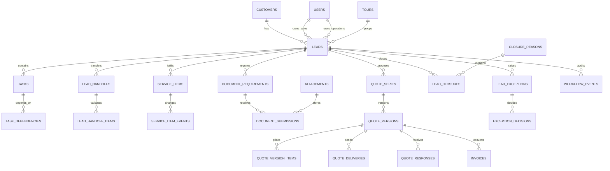

# TravelSync Target Data Model Specification

**Status:** Technical design baseline  
**Version:** 1.0  
**Date:** 25 August 2026  
**Related:** [Role Workflows](ROLE_WORKFLOW_SPECIFICATION.md) · [Full Lead Workflow](FULL_LEAD_WORKFLOW_SPECIFICATION.md) · [Information Architecture](INFORMATION_ARCHITECTURE_SPECIFICATION.md) · [Workflow Engine](WORKFLOW_ENGINE_SPECIFICATION.md) · [Migration Plan](EXISTING_SYSTEM_MIGRATION_PLAN.md)

## 1. Purpose

This document defines the target relational data model required to implement the approved TravelSync workflows and wireframes.

It covers:

- Lead lifecycle stages and ownership
- Tasks and dependencies
- Sales-to-Operations handoffs
- Operational service items
- Document requirements and files
- Versioned quotes
- Closure reasons and closure history
- Exceptions and approvals
- Immutable workflow events
- Constraints, indexes, retention, and migration compatibility

This is a target model, not a single-migration instruction. It should be delivered in compatible phases while the current application remains operational.

## 2. Database conventions

### 2.1 Platform assumptions

- Laravel 12 and Eloquent
- MySQL-compatible production database unless deployment configuration states otherwise
- Integer primary keys for compatibility with existing records
- UTC database timestamps; localization occurs at presentation boundaries
- Application enums stored as bounded strings, not database-native enums
- Soft deletion only where business recovery is valid
- Financial and audit records are never cascade-deleted through normal workflows

### 2.2 Naming

- Tables: plural `snake_case`
- Foreign keys: singular model plus `_id`
- Timestamps: `_at`
- Boolean flags: `is_` or `has_`
- Monetary amounts: `decimal(15,2)` plus explicit currency
- State fields: `status`, with a domain-specific prefix where ambiguity exists
- Immutable event payloads: JSON containing only business-relevant snapshots

### 2.3 Identifier strategy

- Retain numeric `id` primary keys for existing model compatibility.
- Retain and enforce a unique human-readable lead reference.
- Add UUID/ULID `public_id` only if external APIs or unguessable public links require it.
- User-facing URLs should prefer references or route-bound IDs without changing relational primary keys.

### 2.4 Foreign-key deletion policy

| Relationship type | Policy |
|---|---|
| Lead-owned temporary/configuration data | Cascade where safe |
| User actor/owner | `nullOnDelete`; preserve historical record |
| Customer | Restrict or null according to merge policy; never silently delete leads |
| Quote/version used by invoice | Restrict or `nullOnDelete` with immutable snapshot retained |
| Financial records | Restrict deletion; use reversal/void workflows |
| Workflow events | Never cascade from normal business deletion |
| Attachments/files | Soft-delete metadata; physical deletion uses retention job |

## 3. Domain relationship overview



## 4. Lead aggregate

The lead remains the aggregate root for the customer opportunity and confirmed booking. It must not be replaced by separate sales and operations copies.

### 4.1 Target `leads` table

Existing columns remain during migration. The following target columns become authoritative:

| Column | Type | Null | Default | Purpose |
|---|---|:---:|---|---|
| `id` | bigint unsigned PK | No | — | Internal identity |
| `reference_id` | varchar(40) | No | generated | Stable human reference |
| `customer_id` | FK customers | Yes | null | Canonical customer |
| `lead_type` | varchar(32) | No | `standard` | Standard, group, cruise, visa, other |
| `lifecycle_stage` | varchar(40) | No | `new_inquiry` | Canonical lifecycle stage |
| `sales_owner_id` | FK users | Yes | null | Accountable Sales owner |
| `operations_owner_id` | FK users | Yes | null | Accountable Operations owner |
| `created_by` | FK users | Yes | null | Staff creator; null allowed for system intake |
| `source_type` | varchar(40) | Yes | null | WhatsApp, Facebook, email, phone, referral, manual, other |
| `source_payload` | json | Yes | null | Bounded attribution metadata |
| `priority` | varchar(16) | No | `normal` | Low, normal, high, urgent |
| `waiting_reason` | varchar(40) | Yes | null | Explicit paused dependency |
| `waiting_until` | datetime | Yes | null | Expected response/review time |
| `next_action_at` | datetime | Yes | null | Denormalized next open task time |
| `confirmed_at` | datetime | Yes | null | Current booking confirmation time |
| `confirmed_by` | FK users | Yes | null | Actor confirming booking |
| `accepted_quote_version_id` | FK quote_versions | Yes | null | Commercial snapshot accepted by customer |
| `current_handoff_id` | FK lead_handoffs | Yes | null | Latest active handoff |
| `current_closure_id` | FK lead_closures | Yes | null | Latest active closure, null while open |
| `tour_id` | FK tours | Yes | null | Required for confirmed group bookings |
| `stage_entered_at` | datetime | No | current | Stage-age reporting |
| `last_customer_activity_at` | datetime | Yes | null | Customer communication activity |
| `last_internal_activity_at` | datetime | Yes | null | Staff/system activity |
| `lock_version` | unsigned int | No | 1 | Optimistic concurrency control |
| `archived_at` | datetime | Yes | null | Visibility/storage state |
| `archived_by` | FK users | Yes | null | Archive actor |
| `created_at` / `updated_at` | timestamps | No | — | Standard timestamps |
| `deleted_at` | soft delete | Yes | null | Exceptional recovery only |

### 4.2 Lifecycle stage values

Define `LeadLifecycleStage` as a backed PHP enum:

| Stored value | UI label | Category |
|---|---|---|
| `new_inquiry` | New inquiry | Sales |
| `assigned` | Assigned | Sales |
| `qualification` | Qualification | Sales |
| `ready_for_pricing` | Ready for pricing | Sales |
| `pricing` | Pricing | Sales |
| `quote_sent` | Quote sent | Sales |
| `negotiation` | Negotiation | Sales |
| `confirmed` | Confirmed | Sales/booking |
| `operations_handover` | Operations handover | Cross-functional |
| `in_fulfilment` | In fulfilment | Operations |
| `ready_to_travel` | Ready to travel | Operations |
| `travel_completed` | Travel completed | Post-travel |
| `closed` | Closed | Terminal |

Do not add assignment, service completion, document completion, payment, or quote-draft states to this enum.

### 4.3 Lead type values

Define `LeadType`:

- `standard`
- `group`
- `cruise`
- `visa`
- `other`

Replace `is_group_lead`, `is_cruise_lead`, and `is_other_lead` with this single field after compatibility migration. During transition, write both representations from one compatibility service.

### 4.4 Lead field ownership

| Field group | Source of truth |
|---|---|
| Customer identity/contact | Customer plus lead snapshot where needed |
| Travel requirements | Lead/requirement fields |
| Lifecycle | Workflow engine only |
| Sales owner | Assignment action |
| Operations owner | Handoff/assignment action |
| Commercial acceptance | Accepted quote version |
| Payment state | Derived from invoices and customer payments |
| Operations readiness | Derived from service/document requirements and exceptions |
| Health | Derived service/cache, not manual truth |
| Next action | Derived from open tasks |

### 4.5 Lead constraints

- `reference_id` unique.
- `current_closure_id` must be non-null when `lifecycle_stage = closed` after migration enforcement.
- `confirmed_at` and `accepted_quote_version_id` required for stages at or after confirmed, except approved migrated exceptions.
- `tour_id` required when `lead_type = group` and stage is confirmed or later.
- `sales_owner_id` required after `new_inquiry` unless an explicit queue exception exists.
- `operations_owner_id` required after handoff acceptance.
- `waiting_reason` and `waiting_until` are set/cleared together where policy requires a date.
- Direct lifecycle updates outside the workflow service are prohibited by application architecture and tests.

### 4.6 Lead indexes

```text
unique(reference_id)
index(lifecycle_stage, archived_at)
index(sales_owner_id, lifecycle_stage, next_action_at)
index(operations_owner_id, lifecycle_stage, next_action_at)
index(lead_type, lifecycle_stage)
index(customer_id, created_at)
index(tour_id, lifecycle_stage)
index(waiting_until)
index(stage_entered_at)
index(last_customer_activity_at)
```

## 5. Tasks

Tasks are the operational unit behind My Work. A lifecycle stage does not replace tasks.

### 5.1 `tasks` table

| Column | Type | Null | Default | Purpose |
|---|---|:---:|---|---|
| `id` | bigint PK | No | — | Identity |
| `lead_id` | FK leads | No | — | Parent workflow |
| `task_type` | varchar(50) | No | — | Controlled semantic type |
| `title` | varchar(255) | No | — | Human-readable action |
| `description` | text | Yes | null | Supporting context |
| `status` | varchar(24) | No | `open` | Task state |
| `priority` | varchar(16) | No | `normal` | Task priority |
| `owner_id` | FK users | Yes | null | Person accountable |
| `owner_role` | varchar(32) | Yes | null | Queue role when person unassigned |
| `created_by` | FK users | Yes | null | Actor/system creator |
| `due_at` | datetime | Yes | null | Required completion time |
| `started_at` | datetime | Yes | null | Work start |
| `completed_at` | datetime | Yes | null | Completion time |
| `completed_by` | FK users | Yes | null | Completion actor |
| `outcome_code` | varchar(50) | Yes | null | Structured completion outcome |
| `outcome_notes` | text | Yes | null | Outcome explanation |
| `waiting_reason` | varchar(40) | Yes | null | Paused dependency |
| `waiting_until` | datetime | Yes | null | Expected dependency time |
| `related_type` | varchar(100) | Yes | null | Optional morph target class/type |
| `related_id` | bigint | Yes | null | Quote, service, document, call, exception, etc. |
| `automation_key` | varchar(120) | Yes | null | Idempotent system task key |
| `metadata` | json | Yes | null | Bounded task-type data |
| timestamps | — | No | — | Standard timestamps |
| `deleted_at` | soft delete | Yes | null | Recovery; not normal completion |

### 5.2 Task status values

Define `TaskStatus`:

- `open`
- `in_progress`
- `waiting`
- `completed`
- `cancelled`

Overdue is derived: status is active and `due_at < now()`.

### 5.3 Task types

Initial controlled values:

- `assign_inquiry`
- `first_contact`
- `complete_qualification`
- `prepare_pricing`
- `approve_quote`
- `customer_follow_up`
- `renew_or_close_quote`
- `complete_handover`
- `review_handover`
- `correct_handover`
- `plan_services`
- `complete_service`
- `obtain_customer_information`
- `verify_document`
- `resolve_exception`
- `issue_invoice`
- `collect_customer_payment`
- `review_vendor_bill`
- `pay_supplier`
- `readiness_review`
- `pre_departure_call`
- `post_arrival_call`
- `resolve_customer_issue`
- `reconcile_booking`
- `custom`

Use task-type configuration for labels and permitted outcomes; do not create a table per task type.

### 5.4 Task dependencies

`task_dependencies`:

| Column | Type | Purpose |
|---|---|---|
| `id` | bigint PK | Identity |
| `task_id` | FK tasks | Dependent task |
| `depends_on_task_id` | FK tasks | Blocking task |
| `dependency_type` | varchar(24) | `finish_to_start` initially |
| timestamps | — | Audit timestamps |

Constraints:

- Unique `(task_id, depends_on_task_id)`.
- Task cannot depend on itself.
- Application service prevents dependency cycles.
- Both tasks must belong to the same lead unless an approved cross-record dependency is introduced.

### 5.5 Task comments/history

Task lifecycle changes are written to `workflow_events`; do not add an unconstrained task-history duplication. User discussion uses lead notes/mentions or a future generic comments model.

### 5.6 Task indexes

```text
index(owner_id, status, due_at)
index(owner_role, status, due_at)
index(lead_id, status, due_at)
unique(automation_key) where supported, otherwise application-enforced unique nullable key
index(related_type, related_id)
index(waiting_until)
```

## 6. Sales-to-Operations handoffs

Handoffs are versioned review contracts. Returning a handoff does not unconfirm a booking.

### 6.1 `lead_handoffs` table

| Column | Type | Null | Purpose |
|---|---|:---:|---|
| `id` | bigint PK | No | Identity |
| `lead_id` | FK leads | No | Booking |
| `version` | unsigned int | No | Handoff revision number |
| `status` | varchar(24) | No | Draft/submitted/accepted/returned/cancelled |
| `sales_owner_id` | FK users | Yes | Sales owner snapshot |
| `operations_owner_id` | FK users | Yes | Proposed/accepted Operations owner |
| `submitted_at` | datetime | Yes | Submission time |
| `submitted_by` | FK users | Yes | Submitter |
| `review_due_at` | datetime | Yes | Review SLA |
| `reviewed_at` | datetime | Yes | Decision time |
| `reviewed_by` | FK users | Yes | Reviewer |
| `return_reason_code` | varchar(50) | Yes | Structured return reason |
| `return_notes` | text | Yes | Correction details |
| `summary_snapshot` | json | No | Confirmed business summary at submission |
| `lock_version` | unsigned int | No | Concurrency |
| timestamps | — | No | Standard timestamps |

### 6.2 Handoff status values

- `draft`
- `submitted`
- `accepted`
- `returned`
- `cancelled`

Only the latest non-cancelled version is active. Accepted versions are immutable except for administrative correction events.

### 6.3 `lead_handoff_items` table

Each row represents a required checklist item and its evidence at a specific handoff version.

| Column | Type | Purpose |
|---|---|---|
| `id` | bigint PK | Identity |
| `lead_handoff_id` | FK handoffs | Parent |
| `item_key` | varchar(60) | Controlled checklist key |
| `label_snapshot` | varchar(255) | Label at submission |
| `status` | varchar(24) | Complete, incomplete, not_applicable, exception |
| `value_snapshot` | json | Relevant submitted data/evidence |
| `verified_at` | datetime nullable | Review time |
| `verified_by` | FK users nullable | Reviewer |
| `notes` | text nullable | Reviewer/submitter notes |
| `sort_order` | unsigned int | Display order |
| timestamps | — | Standard timestamps |

Unique `(lead_handoff_id, item_key)`.

Initial item keys:

- `accepted_quote`
- `customer_details`
- `passenger_details`
- `travel_dates_itinerary`
- `included_excluded_services`
- `payment_deposit_evidence`
- `supplier_assumptions`
- `visa_document_requirements`
- `special_requests`
- `customer_promises_deadlines`
- `attachments`
- `tour_master_link`
- `known_risks`

Checklist templates may later be configured by lead type, but each submitted version stores its own snapshot.

### 6.4 Handoff constraints/indexes

- Unique `(lead_id, version)`.
- Only confirmed-or-later leads may submit handoff.
- Submission requires all mandatory items complete or attached to approved exceptions.
- Acceptance requires `operations_owner_id`.
- Return requires reason code and notes where configured.
- Index `(status, review_due_at)` and `(operations_owner_id, status, review_due_at)`.

## 7. Operational service items

Replace the four fixed lead status columns with extensible service records.

### 7.1 `service_items` table

| Column | Type | Null | Purpose |
|---|---|:---:|---|
| `id` | bigint PK | No | Identity |
| `lead_id` | FK leads | No | Booking |
| `service_type` | varchar(40) | No | Air, hotel, visa, etc. |
| `title` | varchar(255) | No | Specific deliverable |
| `description` | text | Yes | Requirements/context |
| `status` | varchar(32) | No | Operational state |
| `is_required` | boolean | No | Gate participation |
| `owner_id` | FK users | Yes | Operational owner |
| `supplier_id` | FK suppliers | Yes | Selected supplier |
| `due_at` | datetime | Yes | Completion deadline |
| `started_at` | datetime | Yes | Work start |
| `completed_at` | datetime | Yes | Completion time |
| `completed_by` | FK users | Yes | Completion actor |
| `supplier_reference` | varchar(255) | Yes | Confirmation/booking reference |
| `quoted_amount` | decimal(15,2) | Yes | Customer commercial allocation if authorized |
| `committed_cost` | decimal(15,2) | Yes | Current supplier commitment |
| `currency` | char(3) | No | LKR or transaction currency |
| `customer_visible_notes` | text | Yes | Approved external detail |
| `internal_notes` | text | Yes | Internal context |
| `sort_order` | unsigned int | No | Display order |
| `metadata` | json | Yes | Type-specific bounded fields |
| timestamps | — | No | Standard timestamps |
| `deleted_at` | soft delete | Yes | Recovery/cancel replacement |

### 7.2 Service type values

Initial `ServiceType`:

- `air_ticket`
- `hotel`
- `visa`
- `land_package`
- `transfer`
- `cruise`
- `insurance`
- `activity`
- `guide`
- `transport`
- `other`

### 7.3 Service status values

Define `ServiceItemStatus`:

- `not_required`
- `pending`
- `in_progress`
- `awaiting_customer`
- `awaiting_supplier`
- `done`
- `exception`
- `cancelled`

### 7.4 `service_item_events` table

Optional domain-specific event stream for efficient service history; workflow events remain the global audit truth.

| Column | Type | Purpose |
|---|---|---|
| `id` | bigint PK | Identity |
| `service_item_id` | FK service_items | Parent |
| `event_type` | varchar(50) | Status, supplier, reference, deadline, cost, note |
| `actor_id` | FK users nullable | Actor |
| `from_value` | json nullable | Previous value |
| `to_value` | json nullable | New value |
| `reason` | text nullable | Change reason |
| `occurred_at` | datetime | Domain time |
| `created_at` | timestamp | Storage time |

This table can be omitted initially if `workflow_events` fully satisfies service history and reporting performance.

### 7.5 Service constraints/indexes

- Done requires completion timestamp and actor/system identity.
- Cancelled requires reason in a workflow event.
- A mandatory service in exception requires an open or approved linked exception.
- Ready-to-travel gate checks all current required services.
- Index `(lead_id, status)`, `(owner_id, status, due_at)`, `(supplier_id, status)`, `(due_at, status)`.

## 8. Document requirements and submissions

Document requirements describe what is needed; submissions describe what was uploaded. One requirement may receive multiple rejected/replacement files.

### 8.1 `document_requirements` table

| Column | Type | Null | Purpose |
|---|---|:---:|---|
| `id` | bigint PK | No | Identity |
| `lead_id` | FK leads | No | Lead/booking |
| `traveller_key` | varchar(100) | Yes | Passenger-specific stable key |
| `service_item_id` | FK service_items | Yes | Related service |
| `document_type` | varchar(50) | No | Passport, visa, ticket, etc. |
| `title` | varchar(255) | No | Requirement label |
| `status` | varchar(32) | No | Requirement state |
| `is_required` | boolean | No | Readiness participation |
| `requested_at` | datetime | Yes | Customer request time |
| `requested_by` | FK users | Yes | Request actor |
| `due_at` | datetime | Yes | Required receipt time |
| `verified_at` | datetime | Yes | Verification time |
| `verified_by` | FK users | Yes | Verifier |
| `rejection_reason` | text | Yes | Latest rejection reason |
| `notes` | text | Yes | Internal context |
| `metadata` | json | Yes | Expiry, country, passenger details |
| timestamps | — | No | Standard timestamps |
| `deleted_at` | soft delete | Yes | Recovery |

### 8.2 Document status values

- `not_required`
- `required`
- `requested`
- `received`
- `verified`
- `replacement_required`
- `complete`
- `waived`

`complete` may be used for composite requirements; simple requirements normally finish at `verified`. Waived requires an approved exception or authorized reason.

### 8.3 `document_submissions` table

| Column | Type | Purpose |
|---|---|---|
| `id` | bigint PK | Identity |
| `document_requirement_id` | FK requirements | Parent |
| `attachment_id` | FK attachments | Stored file |
| `submission_number` | unsigned int | Replacement/version order |
| `status` | varchar(24) | Submitted, accepted, rejected, superseded |
| `submitted_at` | datetime | Receipt time |
| `submitted_by` | FK users nullable | Staff/system/customer source |
| `reviewed_at` | datetime nullable | Review time |
| `reviewed_by` | FK users nullable | Reviewer |
| `rejection_reason` | text nullable | Reason |
| `metadata` | json nullable | Capture source, OCR/scan metadata |
| timestamps | — | Standard timestamps |

Unique `(document_requirement_id, submission_number)`.

### 8.4 Target `attachments` evolution

The existing lead-only attachment table should become generic while preserving storage compatibility:

| New column | Purpose |
|---|---|
| `attachable_type`, `attachable_id` | Polymorphic owning context |
| `disk` | Storage disk snapshot |
| `path` | Replace/alias `file_path` |
| `original_name` | Existing name |
| `mime_type` | Validated MIME type |
| `size_bytes` | Stored size |
| `checksum_sha256` | Integrity/duplicate detection |
| `visibility` | Internal, customer, restricted |
| `uploaded_by` | Actor |
| `scanned_at`, `scan_status` | Future malware-scan state |
| `deleted_at` | Metadata retention |

Do not expose direct public storage URLs for restricted customer documents. Use authenticated authorization-aware downloads.

### 8.5 Document indexes

```text
index(lead_id, status, due_at)
index(service_item_id, status)
index(document_type, status)
index(traveller_key, document_type)
unique(document_requirement_id, submission_number)
index(attachable_type, attachable_id)
index(checksum_sha256)
```

## 9. Versioned quotes

The current one-quote-per-lead model cannot represent immutable sent versions and amendments. Separate the commercial series from its immutable versions.

### 9.1 `quote_series` table

| Column | Type | Purpose |
|---|---|---|
| `id` | bigint PK | Identity |
| `lead_id` | FK leads | Parent lead |
| `quote_number` | varchar(50) unique | Stable commercial number |
| `status` | varchar(24) | Open, accepted, declined, expired, withdrawn |
| `current_version_id` | FK quote_versions nullable | Current working/sent version |
| `accepted_version_id` | FK quote_versions nullable | Accepted snapshot |
| `created_by` | FK users nullable | Creator |
| timestamps | — | Standard timestamps |
| `deleted_at` | soft delete | Draft recovery only |

Initial policy may allow one active quote series per lead, but the schema permits future alternative proposals.

### 9.2 `quote_versions` table

| Column | Type | Null | Purpose |
|---|---|:---:|---|
| `id` | bigint PK | No | Identity |
| `quote_series_id` | FK quote_series | No | Parent series |
| `version_number` | unsigned int | No | Version sequence |
| `status` | varchar(24) | No | Draft/approval/ready/sent/superseded/accepted/etc. |
| `supersedes_version_id` | self FK | Yes | Prior version |
| `subject` | varchar(255) | Yes | Proposal subject |
| `quote_date` | date | Yes | Effective date |
| `valid_until` | datetime | Yes | Expiry boundary |
| `currency` | char(3) | No | Currency |
| `subtotal` | decimal(15,2) | No | Calculated subtotal |
| `discount_amount` | decimal(15,2) | No | Discount |
| `tax_amount` | decimal(15,2) | No | Tax if applicable |
| `total_amount` | decimal(15,2) | No | Final customer total |
| `expected_cost` | decimal(15,2) | Yes | Internal expected cost |
| `expected_margin_amount` | decimal(15,2) | Yes | Derived snapshot |
| `expected_margin_percent` | decimal(7,4) | Yes | Derived snapshot |
| `terms` | text | Yes | Payment/cancellation terms |
| `inclusions` | text | Yes | Customer inclusions |
| `exclusions` | text | Yes | Customer exclusions |
| `notes` | text | Yes | Customer-visible notes |
| `internal_notes` | text | Yes | Internal notes |
| `created_by` | FK users | Yes | Creator |
| `approved_at` / `approved_by` | datetime/FK | Yes | Approval |
| `sent_at` | datetime | Yes | First successful send |
| `accepted_at` | datetime | Yes | Acceptance time |
| `locked_at` | datetime | Yes | Immutability boundary |
| `snapshot_hash` | char(64) | Yes | Integrity hash of commercial snapshot |
| timestamps | — | No | Standard timestamps |

### 9.3 Quote-version status values

- `draft`
- `awaiting_approval`
- `changes_requested`
- `ready`
- `sent`
- `superseded`
- `accepted`
- `declined`
- `expired`
- `withdrawn`

Rules:

- Draft versions are editable.
- Ready versions are validated but may be returned to draft before sending.
- Sent, accepted, superseded, declined, expired, and withdrawn versions are immutable.
- Amendment clones a sent/accepted-relevant version into a new draft row.
- Only one editable current version per series.
- Acceptance must reference the exact version.

### 9.4 `quote_version_items` table

| Column | Type | Purpose |
|---|---|---|
| `id` | bigint PK | Identity |
| `quote_version_id` | FK quote_versions | Parent version |
| `service_item_id` | FK service_items nullable | Optional operational lineage |
| `sort_order` | unsigned int | Display order |
| `item_code` | varchar(50) nullable | Stable category/code |
| `description` | text | Customer description |
| `customer_details` | text nullable | Additional detail |
| `quantity` | decimal(15,4) | Quantity |
| `unit_rate` | decimal(15,2) | Customer rate |
| `discount_amount` | decimal(15,2) | Line discount |
| `tax_amount` | decimal(15,2) | Line tax |
| `line_total` | decimal(15,2) | Final line total |
| `expected_unit_cost` | decimal(15,2) nullable | Internal cost |
| `currency` | char(3) | Currency |
| `metadata` | json nullable | Dates/traveller/type details |
| timestamps | — | Standard timestamps |

### 9.5 `quote_deliveries` table

Records every send/resend attempt:

| Column | Type | Purpose |
|---|---|---|
| `id` | bigint PK | Identity |
| `quote_version_id` | FK versions | Exact version |
| `channel` | varchar(24) | WhatsApp, email, manual, print |
| `recipient` | varchar(255) nullable | Recipient snapshot |
| `status` | varchar(24) | Pending, sent, delivered, failed |
| `sent_by` | FK users nullable | Sender |
| `sent_at` | datetime nullable | Send time |
| `delivered_at` | datetime nullable | Delivery time |
| `external_message_id` | varchar(255) nullable | Provider reference |
| `failure_code` / `failure_message` | varchar/text nullable | Error detail |
| `pdf_attachment_id` | FK attachments nullable | Exact generated PDF |
| timestamps | — | Standard timestamps |

### 9.6 `quote_responses` table

| Column | Type | Purpose |
|---|---|---|
| `id` | bigint PK | Identity |
| `quote_version_id` | FK versions | Exact version |
| `response_type` | varchar(32) | Accepted, amendment, considering, declined, no_response |
| `reason_code` | varchar(50) nullable | Structured outcome |
| `notes` | text nullable | Details |
| `channel` | varchar(24) nullable | Evidence channel |
| `evidence_attachment_id` | FK attachments nullable | Evidence |
| `recorded_at` | datetime | Customer response time |
| `recorded_by` | FK users nullable | Actor |
| timestamps | — | Standard timestamps |

### 9.7 Quote indexes/constraints

```text
unique(quote_series.quote_number)
unique(quote_versions.quote_series_id, quote_versions.version_number)
index(quote_series.lead_id, quote_series.status)
index(quote_versions.status, quote_versions.valid_until)
index(quote_deliveries.status, quote_deliveries.sent_at)
index(quote_responses.response_type, quote_responses.recorded_at)
```

`invoices.quote_id` should migrate to `accepted_quote_version_id` or a new `quote_version_id`. The invoice stores its own immutable line-item and total snapshot, so later quote changes never alter issued invoices.

## 10. Closure reasons and closure history

Closure is a business event with structured reasoning, not a boolean or destructive deletion.

### 10.1 `closure_reasons` table

| Column | Type | Purpose |
|---|---|---|
| `id` | bigint PK | Identity |
| `code` | varchar(50) unique | Stable code |
| `label` | varchar(255) | UI label |
| `category` | varchar(32) | Successful, lost, administrative, cancelled |
| `description` | text nullable | Guidance |
| `requires_notes` | boolean | Require detail |
| `requires_manager_approval` | boolean | Approval gate |
| `is_active` | boolean | Availability |
| `sort_order` | unsigned int | UI order |
| timestamps | — | Configuration audit |

Initial codes:

- `booked_completed`
- `other_service_completed`
- `customer_declined`
- `no_response`
- `price_not_accepted`
- `dates_unavailable`
- `service_unavailable`
- `booked_elsewhere`
- `duplicate_merged`
- `invalid_spam`
- `created_in_error`
- `cancelled_before_confirmation`
- `cancelled_after_confirmation`
- `supplier_company_cancellation`
- `other`

### 10.2 `lead_closures` table

| Column | Type | Purpose |
|---|---|---|
| `id` | bigint PK | Identity |
| `lead_id` | FK leads | Closed lead |
| `closure_reason_id` | FK reasons | Structured reason |
| `notes` | text nullable | Required explanation where configured |
| `closed_from_stage` | varchar(40) | Prior lifecycle stage |
| `closed_at` | datetime | Effective closure |
| `closed_by` | FK users nullable | Actor/system |
| `merged_into_lead_id` | FK leads nullable | Duplicate survivor |
| `approval_exception_id` | FK lead_exceptions nullable | Required approval link |
| `reopened_at` | datetime nullable | Reopen time |
| `reopened_by` | FK users nullable | Reopen actor |
| `reopen_reason` | text nullable | Required reason |
| `reopened_to_stage` | varchar(40) nullable | Target stage |
| timestamps | — | Storage timestamps |

Rules:

- A lead may have multiple closure records over its lifetime.
- Only the current closure is referenced by `leads.current_closure_id`.
- Reopening updates the closure history and clears the current pointer transactionally.
- Merging requires `merged_into_lead_id` and prevents merging into self.
- Closure does not archive or soft-delete the lead.

## 11. Exceptions and approvals

Exceptions represent explicit departures from normal gates, deadlines, commercial thresholds, or operational readiness.

### 11.1 `lead_exceptions` table

| Column | Type | Null | Purpose |
|---|---|:---:|---|
| `id` | bigint PK | No | Identity |
| `lead_id` | FK leads | No | Parent lead |
| `exception_type` | varchar(50) | No | Controlled type |
| `status` | varchar(24) | No | Open/review/approved/rejected/resolved/cancelled |
| `severity` | varchar(16) | No | Low, medium, high, critical |
| `title` | varchar(255) | No | Summary |
| `description` | text | No | What is wrong/being requested |
| `requested_outcome` | text | Yes | Desired exception |
| `business_impact` | text | Yes | Customer/finance/operations impact |
| `owner_id` | FK users | Yes | Resolver |
| `requested_by` | FK users | Yes | Requester |
| `requested_at` | datetime | No | Request time |
| `decision_due_at` | datetime | Yes | Approval SLA |
| `approved_until` | datetime | Yes | Time-bounded approval |
| `related_type` / `related_id` | morph pair | Yes | Quote, service, document, closure, payment, etc. |
| `resolution_notes` | text | Yes | Final resolution |
| `resolved_at` / `resolved_by` | datetime/FK | Yes | Resolution |
| `metadata` | json | Yes | Threshold/snapshot data |
| timestamps | — | No | Standard timestamps |

Initial exception types:

- `confirmation_without_deposit`
- `low_margin_quote`
- `expired_quote_acceptance`
- `missing_handover_item`
- `service_not_ready`
- `document_waiver`
- `finance_clearance`
- `supplier_cost_variance`
- `customer_refund`
- `write_off`
- `post_confirmation_change`
- `cancellation_approval`
- `closure_approval`
- `data_correction`
- `other`

### 11.2 Exception status values

- `open`
- `awaiting_review`
- `approved`
- `rejected`
- `resolved`
- `cancelled`

Approval and resolution are separate. An approved readiness exception remains active until its underlying issue is resolved, expires, or the booking completes.

### 11.3 `exception_decisions` table

Preserve multi-step or second-approver decisions:

| Column | Type | Purpose |
|---|---|---|
| `id` | bigint PK | Identity |
| `lead_exception_id` | FK exceptions | Parent |
| `decision` | varchar(24) | Approved, rejected, changes_requested |
| `decided_by` | FK users nullable | Approver |
| `decided_at` | datetime | Decision time |
| `notes` | text nullable | Reason/conditions |
| `conditions` | json nullable | Approval conditions |
| `sequence` | unsigned int | Approval order |
| timestamps | — | Storage timestamps |

Unique `(lead_exception_id, sequence)`.

### 11.4 Exception indexes

```text
index(lead_id, status, severity)
index(owner_id, status, decision_due_at)
index(exception_type, status)
index(related_type, related_id)
index(approved_until)
```

## 12. Workflow events

Workflow events form the immutable cross-functional audit timeline and analytics event source.

### 12.1 `workflow_events` table

| Column | Type | Null | Purpose |
|---|---|:---:|---|
| `id` | bigint PK | No | Ordered identity |
| `event_uuid` | uuid/char(36) unique | No | Idempotency/correlation |
| `lead_id` | FK leads | No | Aggregate |
| `event_type` | varchar(80) | No | Stable semantic event |
| `event_version` | unsigned smallint | No | Payload schema version |
| `actor_type` | varchar(24) | No | User, system, integration |
| `actor_id` | FK users | Yes | User actor where applicable |
| `occurred_at` | datetime(6) | No | Business occurrence time |
| `recorded_at` | datetime(6) | No | Storage time |
| `subject_type` | varchar(100) | Yes | Related entity type |
| `subject_id` | bigint | Yes | Related entity ID |
| `correlation_id` | uuid/char(36) | Yes | Multi-write workflow transaction |
| `causation_event_uuid` | uuid/char(36) | Yes | Event causing automation |
| `source` | varchar(32) | No | UI, job, webhook, migration, API, command |
| `summary` | varchar(500) | No | Human-readable timeline summary |
| `before` | json | Yes | Minimal prior values |
| `after` | json | Yes | Minimal new values |
| `metadata` | json | Yes | Reason, channel, references, SLA data |
| `request_id` | varchar(100) | Yes | Operational trace ID |
| `ip_hash` | char(64) | Yes | Optional privacy-preserving security trace |

The table should use `created_at` only if required by Laravel conventions; events are never updated, soft-deleted, or normally deleted.

### 12.2 Event type catalogue

Namespaces use dot-separated stable names:

#### Lead

- `lead.created`
- `lead.source_updated`
- `lead.type_changed`
- `lead.priority_changed`
- `lead.archived`
- `lead.restored`
- `lead.merged`

#### Lifecycle

- `lifecycle.transitioned`
- `lifecycle.waiting_started`
- `lifecycle.waiting_ended`
- `lead.confirmed`
- `lead.closed`
- `lead.reopened`
- `booking.cancelled`

#### Assignment

- `assignment.sales_assigned`
- `assignment.sales_reassigned`
- `assignment.operations_assigned`
- `assignment.operations_reassigned`
- `assignment.collaborator_added`
- `assignment.collaborator_removed`

#### Task

- `task.created`
- `task.started`
- `task.waiting`
- `task.rescheduled`
- `task.reassigned`
- `task.completed`
- `task.cancelled`

#### Handoff

- `handoff.drafted`
- `handoff.submitted`
- `handoff.returned`
- `handoff.resubmitted`
- `handoff.accepted`
- `handoff.cancelled`

#### Quote

- `quote.series_created`
- `quote.version_created`
- `quote.version_updated`
- `quote.approval_requested`
- `quote.approved`
- `quote.changes_requested`
- `quote.sent`
- `quote.delivery_failed`
- `quote.response_recorded`
- `quote.accepted`
- `quote.expired`
- `quote.superseded`
- `quote.converted_to_invoice`

#### Operations/documents

- `service.created`
- `service.status_changed`
- `service.supplier_assigned`
- `service.reference_added`
- `service.cost_changed`
- `document.requested`
- `document.received`
- `document.verified`
- `document.rejected`
- `document.waived`
- `readiness.reviewed`
- `readiness.revoked`

#### Finance

- `invoice.created`
- `invoice.issued`
- `invoice.voided`
- `customer_payment.recorded`
- `customer_payment.reversed`
- `vendor_bill.created`
- `vendor_bill.approved`
- `vendor_bill.disputed`
- `supplier_payment.recorded`
- `supplier_payment.reversed`
- `finance.hold_applied`
- `finance.hold_cleared`

#### Calls/exceptions

- `call.created`
- `call.assigned`
- `call.attempted`
- `call.completed`
- `call.escalated`
- `exception.opened`
- `exception.review_requested`
- `exception.approved`
- `exception.rejected`
- `exception.resolved`
- `exception.expired`

### 12.3 Event payload rules

- Store only fields relevant to the event.
- Never store access tokens, passwords, full payment secrets, or unnecessary document content.
- Do not rely on translated labels as identifiers.
- Store identifiers and important human snapshots needed for historical readability.
- Increment `event_version` when payload meaning changes.
- Consumers tolerate unknown event types and newer metadata fields.
- Every workflow engine execution uses one `correlation_id` across its writes/events.

### 12.4 Event integrity

- Model disallows `update` and `delete` through normal application code.
- Database user may be restricted from event updates/deletes in production where operationally feasible.
- Corrections append a new corrective event.
- The event is committed in the same database transaction as the business mutation.
- Idempotent jobs/webhooks use deterministic or persisted `event_uuid`/automation keys.

### 12.5 Event indexes/partitioning

```text
unique(event_uuid)
index(lead_id, occurred_at, id)
index(event_type, occurred_at)
index(actor_id, occurred_at)
index(subject_type, subject_id, occurred_at)
index(correlation_id)
index(recorded_at)
```

Consider time partitioning only after measured growth justifies it. Do not compromise lead timeline queries prematurely.

## 13. Lead collaborators and assignments

The two accountable owner columns remain on leads for fast queries. Additional collaboration uses a separate table.

### `lead_collaborators`

| Column | Type | Purpose |
|---|---|---|
| `id` | bigint PK | Identity |
| `lead_id` | FK leads | Parent |
| `user_id` | FK users | Collaborator |
| `role_context` | varchar(32) | Sales, operations, accounts, support |
| `access_level` | varchar(24) | View, contribute |
| `added_by` | FK users nullable | Actor |
| `added_at` | datetime | Effective time |
| `removed_at` | datetime nullable | Historical removal |
| `reason` | text nullable | Reason |

Use a partial/current uniqueness rule in the application to prevent duplicate active collaborations for the same lead/user/context.

## 14. Derived read models

Do not persist business truth merely to display dashboard counts. Use query scopes, cached projections, or materialized summary tables where measured performance requires them.

### 14.1 Lead health projection

Inputs:

- Open overdue tasks
- Travel date proximity
- Mandatory service/document state
- Open exception severity
- Customer-payment/finance holds
- Waiting duration
- Customer-message response state

Output:

- `on_track`
- `attention`
- `at_risk`
- `blocked`

This can be computed initially and later cached in `lead_workflow_summaries`.

### 14.2 Optional `lead_workflow_summaries`

| Column | Purpose |
|---|---|
| `lead_id` unique | Projection key |
| `health` | Derived health |
| `next_task_id` | Current next task |
| `open_task_count` | Count |
| `overdue_task_count` | Count |
| `mandatory_service_total/done` | Readiness |
| `mandatory_document_total/verified` | Readiness |
| `open_exception_count` | Count |
| `blocking_exception_count` | Count |
| `customer_balance` | Safe derived amount |
| `supplier_balance` | Safe derived amount |
| `refreshed_at` | Projection freshness |

Projection updates occur after transaction commit and must be rebuildable from source tables.

## 15. Existing models retained

The target model reuses and evolves:

- `customers`
- `users`
- `tours`
- `invoices` and `invoice_line_items`
- `customer_payments`
- `suppliers`
- `vendor_bills` and line items
- `vendor_bill_payments`
- `supplier_payments`
- `whatsapp_contacts`
- `whatsapp_conversations`
- `whatsapp_messages`
- `call_center_calls`
- `lead_notes` and reads
- `attachments`, after generalization

### Required integration updates

- WhatsApp-created leads write `source_type`, `source_payload`, and canonical lifecycle stage.
- Calls may remain in `call_center_calls` while linking their generated task through `related_type/id`.
- Invoices reference accepted quote version rather than mutable quote header.
- Vendor bills optionally reference service items for cost lineage.
- Existing lead notes remain collaboration notes; they are not audit events.

## 16. Existing columns deprecated

After compatibility rollout and backfill:

| Existing field | Replacement |
|---|---|
| `leads.status` | `leads.lifecycle_stage` |
| `leads.assigned_to` | `leads.sales_owner_id` |
| `leads.assigned_operator` | `leads.operations_owner_id` |
| `is_group_lead`, `is_cruise_lead`, `is_other_lead` | `lead_type` |
| `air_ticket_status`, `hotel_status`, `visa_status`, `land_package_status` | `service_items` |
| `attachments.type`/lead-only ownership | Generic attachments plus document requirements |
| `quotes` mutable single record | Quote series and immutable versions |
| `quote_line_items` | `quote_version_items` |
| `lead_action_logs` | `workflow_events` |
| `archived_at/by` | Retained, with standardized action/event service |

Do not remove deprecated fields until new writes, reads, reports, PDFs, tests, and backfills are verified.

## 17. Data invariants and transactional boundaries

### 17.1 Workflow transition transaction

One transaction must:

1. Lock/reload the lead or validate `lock_version`.
2. Validate actor permission and transition gate.
3. Apply lifecycle/ownership changes.
4. Create, complete, or cancel required tasks.
5. Update handoff/closure/exception pointers.
6. Append workflow events.
7. Commit.
8. Dispatch notifications and projection refresh after commit.

### 17.2 Quote send transaction

- Validate version is ready and current.
- Lock commercial snapshot/hash.
- Create delivery attempt.
- Transition lead if appropriate.
- Create follow-up task.
- Append events.
- External send occurs idempotently in a queued job.

### 17.3 Handoff decision transaction

- Lock current handoff and lead.
- Validate reviewer and checklist.
- Accept or return.
- Assign Operations owner on acceptance.
- Create/cancel cross-team tasks.
- Transition lifecycle on acceptance.
- Append events.

### 17.4 Closure/reopen transaction

- Validate reason, approvals, and open dependencies.
- Create/update closure history.
- Set/clear current closure pointer.
- Transition stage.
- Complete/cancel/recreate tasks.
- Append events.

## 18. Security and privacy

- Field-level authorization protects expected costs, margin, payment details, employee data, and identity documents.
- Documents use authenticated streaming, not public object URLs.
- `source_payload`, task metadata, event metadata, and snapshots have explicit allowlists.
- Sensitive personal data is not duplicated into every event.
- Audit access is separately permissioned.
- Exports enforce the same row/field policies as interactive screens.
- Retention rules distinguish financial, operational, marketing, document, and audit records.
- Customer merge never leaks one customer's restricted documents into another record without validation.

## 19. Retention policy requirements

Exact durations require business/legal approval. The model must support:

- Immutable financial record retention
- Workflow/audit retention
- Customer document expiry and deletion scheduling
- WhatsApp media retention
- Soft-deleted attachment retention before physical deletion
- Anonymization of eligible customer data without breaking aggregate reporting/audit
- Legal hold preventing scheduled deletion

Recommended future support fields:

- `retention_until`
- `legal_hold_at`
- `anonymized_at`
- `purged_at`

Add only after policy is approved rather than guessing retention periods.

## 20. Migration and rollout sequence

### Phase A — Additive foundation

Create:

- New lead canonical columns
- `tasks` and dependencies
- `workflow_events`
- Closure reason/history tables
- Exception/decision tables

Backfill lifecycle and owners while legacy fields remain authoritative.

### Phase B — Dual-read verification

- Workflow service writes legacy and canonical lead fields.
- Compare old dashboard scopes with new lifecycle projections.
- Backfill initial workflow events as migration events, not fabricated historical detail.
- Reconcile discrepancies before UI cutover.

### Phase C — Quote versions

- Create quote-series/version tables.
- Convert each existing quote into one series and version 1.
- Move line items.
- Repoint invoices.
- Verify PDFs/totals.

### Phase D — Handoffs, services, and documents

- Create handoff and checklist tables.
- Create service items from existing fixed status fields.
- Create document requirements/submissions.
- Generalize attachments.

### Phase E — Canonical writes

- Workflow engine becomes the only lifecycle writer.
- New UI reads canonical models.
- Observers stop duplicating workflow business rules.
- Legacy resources become read-only or redirect.

### Phase F — Retire compatibility

- Remove dual writes.
- Update reports/commands/tests.
- Archive or drop deprecated columns only after a rollback window and verified backups.
- Replace `lead_action_logs` reads with workflow events; retain old rows for historical access or migrate as versioned legacy events.

## 21. Backfill rules

### 21.1 Lifecycle mapping

Use the mapping in the Full Lead Workflow specification with evidence-based refinement:

- Quote/send records distinguish Pricing from Quote sent.
- Accepted/converted quote and invoice/payment evidence support Confirmed.
- Operations assignment and service states distinguish Handover from Fulfilment.
- Travel dates and call records distinguish Ready/Completed.
- Archived is not treated as Closed automatically without an outcome.

Every ambiguous record receives:

- Best safe stage
- `migration_needs_review` exception or review task
- Migration event containing source status and mapping rule

### 21.2 Task backfill

- Do not fabricate completed historical tasks.
- Create only current actionable tasks required by the mapped stage.
- Use deterministic `automation_key` values for rerunnable backfills.

### 21.3 Quote backfill

- Existing quote becomes series plus version 1.
- Existing number remains the series number.
- Current status maps conservatively.
- Existing line totals are recalculated and discrepancies reported, not silently overwritten.
- Generated legacy PDFs may be attached as historical snapshots if available.

### 21.4 Service backfill

For each applicable fixed status field, create a service item:

- `air_ticket_status` → `air_ticket`
- `hotel_status` → `hotel`
- `visa_status` → `visa`
- `land_package_status` → `land_package`

Preserve original value in migration event metadata.

## 22. Testing requirements

### Schema/invariant tests

- Unique references/version numbers
- Required ownership by stage
- Group tour requirement
- Closure current-pointer integrity
- Handoff version and checklist uniqueness
- Task dependency cycle prevention
- Quote immutability after send
- Document replacement history
- Exception approval conditions
- Workflow-event immutability

### Workflow integration tests

- Every allowed and prohibited lifecycle transition
- Concurrent assignment and transition conflicts
- Idempotent automated task creation
- Handoff accept/return/resubmit
- Quote send/failure/retry/amend/accept
- Ready-to-travel with services/documents/exceptions
- Close/reopen/merge
- Role and field authorization

### Migration tests

- Production-like legacy fixtures
- Rerunnable backfills
- Row-count and relationship reconciliation
- Quote/invoice total reconciliation
- Rollback/forward-recovery rehearsal
- Old/new report comparison

## 23. Laravel model map

Recommended models:

```text
Lead
Task
TaskDependency
LeadHandoff
LeadHandoffItem
ServiceItem
ServiceItemEvent (optional)
DocumentRequirement
DocumentSubmission
Attachment
QuoteSeries
QuoteVersion
QuoteVersionItem
QuoteDelivery
QuoteResponse
ClosureReason
LeadClosure
LeadException
ExceptionDecision
WorkflowEvent
LeadCollaborator
LeadWorkflowSummary (optional projection)
```

Recommended enum classes:

```text
LeadLifecycleStage
LeadType
TaskStatus
TaskType
HandoffStatus
HandoffItemStatus
ServiceType
ServiceItemStatus
DocumentRequirementStatus
DocumentSubmissionStatus
QuoteSeriesStatus
QuoteVersionStatus
QuoteResponseType
ClosureCategory
ExceptionStatus
ExceptionSeverity
WorkflowActorType
```

## 24. Implementation decisions requiring confirmation

The following decisions should be finalized before migrations are coded:

1. Whether a lead may have multiple simultaneous quote series or one series with versions.
2. Whether all task due dates are mandatory or only SLA-controlled types.
3. Whether customer/passenger data requires a dedicated traveller model in this phase.
4. Whether service costs are stored directly on service items or only through vendor bills.
5. Whether configurable workflow/checklist templates are needed immediately or can begin in code.
6. Exact approval thresholds for margin, refunds, write-offs, and readiness exceptions.
7. Document and audit retention periods.
8. Whether `health` is computed live or maintained as a projection from the first release.
9. Whether PostgreSQL partial indexes are available; otherwise enforce active-row uniqueness in application transactions.
10. Whether legacy `lead_action_logs` remain permanently available or are transformed into versioned legacy workflow events.

## 25. Acceptance criteria

The target data model is ready for implementation when:

1. Lifecycle, ownership, tasks, and next action can be queried without legacy dashboard-specific logic.
2. A confirmed quote is an immutable exact version.
3. Sales-to-Operations handoff has versioned checklist evidence and decisions.
4. Operational services are extensible beyond four fixed columns.
5. Document requirements preserve replacement and verification history.
6. Closure and reopen history is preserved without abusing deletion/archive.
7. Exceptions can approve a gate without falsely changing underlying service/document/payment truth.
8. Every business mutation can append an immutable correlated workflow event.
9. My Work, Pipeline, Operations Board, and audit timeline have indexed query paths.
10. Existing leads, quotes, invoices, attachments, WhatsApp links, tours, and payments have explicit migration paths.
11. Sensitive data has field/document authorization boundaries.
12. Additive rollout, dual verification, canonical cutover, and legacy retirement are separately deployable.
