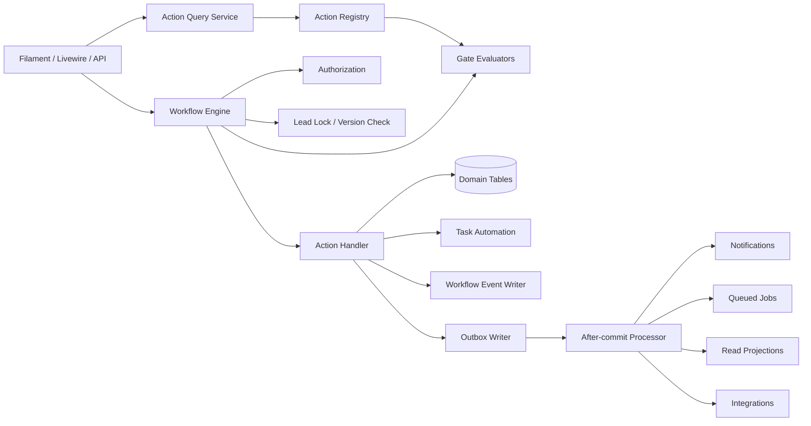

# TravelSync Workflow Engine Specification

**Status:** Technical design baseline  
**Version:** 1.0  
**Date:** 25 August 2026  
**Related:** [Full Lead Workflow](FULL_LEAD_WORKFLOW_SPECIFICATION.md) · [Target Data Model](TARGET_DATA_MODEL_SPECIFICATION.md) · [Information Architecture](INFORMATION_ARCHITECTURE_SPECIFICATION.md) · [Migration Plan](EXISTING_SYSTEM_MIGRATION_PLAN.md) · [Implementation Backlog](IMPLEMENTATION_BACKLOG.md)

## 1. Purpose

This document defines the application service responsible for executing the TravelSync lead and booking workflow.

The engine replaces:

- Direct writes to `leads.status`
- Business rules scattered across Filament pages and model observers
- Duplicate notification logic
- Role-specific URLs embedded in domain logic
- Status-change side effects that occur outside a reliable transaction

The engine provides one consistent contract to Filament, Livewire, controllers, queued jobs, commands, webhooks, tests, and future APIs.

## 2. Responsibilities

The workflow engine must:

1. Return actions available to an actor for a lead.
2. Explain why an unavailable action is blocked.
3. Validate lifecycle stage, ownership, permissions, data gates, approvals, and concurrency.
4. Execute mutations transactionally.
5. Maintain lifecycle, assignments, handoffs, tasks, closures, and exception pointers.
6. Append immutable workflow events in the same transaction.
7. Schedule notifications, jobs, projection refreshes, and integrations after commit.
8. Support safe idempotent retry.
9. Support audited privileged overrides without falsifying underlying business state.
10. Prevent other code paths from bypassing its rules.

The engine must not:

- Render Filament components.
- Construct role-specific page URLs.
- Send external messages inside the database transaction.
- Hide failed side effects by considering the business mutation unsuccessful after it committed.
- Treat notifications as the audit log.
- Recalculate finance by mutating issued documents.

## 3. Architecture



### 3.1 Core components

| Component | Responsibility |
|---|---|
| `LeadWorkflowEngine` | Orchestrates validation and transactional execution |
| `WorkflowActionRegistry` | Maps actions to definitions and handlers |
| `AvailableLeadActions` | Read-only action availability and blocker explanations |
| `WorkflowAuthorizer` | Actor, permission, assignment, and team-scope checks |
| `WorkflowGateRunner` | Executes reusable business gates |
| Action handlers | Perform one named business action |
| `WorkflowTaskPlanner` | Creates/completes/cancels automated tasks idempotently |
| `WorkflowEventWriter` | Appends immutable correlated events |
| `WorkflowOutbox` | Stores after-commit side effects reliably |
| `WorkflowProjectionUpdater` | Refreshes health/next-action summaries |
| `WorkflowOverrideService` | Validates and records privileged exceptions |

### 3.2 Package layout

Recommended Laravel namespace:

```text
app/Domain/LeadWorkflow/
├── Actions/
│   ├── ActionDefinition.php
│   ├── AssignSalesOwner.php
│   ├── CompleteQualification.php
│   ├── SendQuote.php
│   ├── ConfirmBooking.php
│   ├── SubmitHandoff.php
│   ├── AcceptHandoff.php
│   ├── MarkReadyToTravel.php
│   ├── CloseLead.php
│   └── ...
├── Contracts/
├── Data/
│   ├── WorkflowContext.php
│   ├── ActionAvailability.php
│   ├── GateResult.php
│   └── WorkflowResult.php
├── Enums/
│   ├── LeadAction.php
│   └── ...
├── Gates/
├── Handlers/
├── Services/
│   ├── LeadWorkflowEngine.php
│   ├── AvailableLeadActions.php
│   ├── WorkflowActionRegistry.php
│   ├── WorkflowGateRunner.php
│   ├── WorkflowTaskPlanner.php
│   └── WorkflowEventWriter.php
└── Support/
```

Framework-specific presentation adapters stay outside the domain package.

## 4. Public API

### 4.1 Query available actions

```php
public function availableActions(
    Lead $lead,
    User $actor,
    ?WorkflowContext $context = null,
): ActionAvailabilityCollection;
```

Each result includes:

```php
final readonly class ActionAvailability
{
    public function __construct(
        public LeadAction $action,
        public string $label,
        public bool $available,
        public array $blockers,
        public array $warnings,
        public bool $requiresConfirmation,
        public bool $requiresReason,
        public ?string $targetStage,
        public ?string $formSchemaKey,
    ) {}
}
```

The UI uses this output to show primary/secondary actions and disabled-state explanations. The UI must not recreate the rules.

### 4.2 Check one action

```php
public function can(
    Lead $lead,
    LeadAction $action,
    User $actor,
    array $payload = [],
): GateResult;
```

### 4.3 Execute an action

```php
public function execute(
    Lead $lead,
    LeadAction $action,
    User $actor,
    array $payload,
    WorkflowRequest $request,
): WorkflowResult;
```

`WorkflowRequest` contains:

- `idempotencyKey`
- `expectedLockVersion`
- `source`: UI, API, job, webhook, command, migration
- `requestId`
- `correlationId`, optional; generated when absent
- `causationEventUuid`, optional
- `overrideExceptionId`, optional

### 4.4 Result

```php
final readonly class WorkflowResult
{
    public function __construct(
        public Lead $lead,
        public LeadAction $action,
        public string $correlationId,
        public array $eventUuids,
        public array $createdTaskIds,
        public array $completedTaskIds,
        public array $warnings,
        public bool $wasIdempotentReplay,
    ) {}
}
```

## 5. Action model

An action represents business intent. It is not a generic “change status” operation.

### 5.1 `LeadAction` enum

#### Intake and assignment

- `AssignSalesOwner`
- `ClaimInquiry`
- `ReassignSalesOwner`
- `ReturnToIntake`
- `MergeDuplicate`
- `MarkInvalid`

#### Qualification and pricing

- `StartQualification`
- `CompleteQualification`
- `ReturnToQualification`
- `StartPricing`
- `RequestRate`
- `CreateQuoteVersion`
- `SubmitQuoteForApproval`
- `ApproveQuote`
- `RequestQuoteChanges`
- `MarkQuoteReady`
- `SendQuote`

#### Customer response

- `RecordQuoteResponse`
- `StartAmendment`
- `ScheduleCustomerFollowUp`
- `RenewExpiredQuote`
- `ConfirmBooking`

#### Handoff and Operations

- `AssignOperationsOwner`
- `PrepareHandoff`
- `SubmitHandoff`
- `ReturnHandoff`
- `ResubmitHandoff`
- `AcceptHandoff`
- `CreateServiceItem`
- `UpdateServiceItem`
- `RequestDocument`
- `ReviewDocument`
- `PerformReadinessReview`
- `MarkReadyToTravel`
- `RevokeReadiness`
- `MarkTravelCompleted`

#### Tasks and waiting

- `CreateTask`
- `StartTask`
- `CompleteTask`
- `RescheduleTask`
- `ReassignTask`
- `StartWaiting`
- `EndWaiting`

#### Exceptions and terminal actions

- `OpenException`
- `RequestExceptionReview`
- `DecideException`
- `ResolveException`
- `CancelBooking`
- `CloseLead`
- `ReopenLead`
- `ArchiveLead`
- `RestoreLead`

Finance actions may use dedicated domain services but must participate in the shared event/outbox contract where they affect the lead workflow.

### 5.2 Action definition

Each action has one immutable definition:

```php
final readonly class ActionDefinition
{
    public function __construct(
        public LeadAction $action,
        public array $allowedFromStages,
        public ?LeadLifecycleStage $targetStage,
        public array $requiredPermissions,
        public array $gates,
        public string $handler,
        public string $eventType,
        public array $taskEffects,
        public array $outboxEffects,
        public bool $requiresReason = false,
        public bool $requiresConfirmation = false,
        public bool $allowOverride = false,
    ) {}
}
```

Definitions live in code for the first release. A future configuration UI may manage labels, SLAs, checklist templates, and active policies, but handler classes and security rules remain code-controlled.

## 6. Lifecycle transition matrix

The matrix describes normal stage-changing actions. Same-stage actions are defined separately.

| From | Action | To | Primary actor | Essential gate |
|---|---|---|---|---|
| New inquiry | Assign/claim inquiry | Assigned | Sales/Marketing/Admin/manager | Valid sales owner; duplicate resolved |
| Assigned | Start qualification | Qualification | Sales owner | First contact/conversation recorded |
| Qualification | Complete qualification | Ready for pricing | Sales owner | Qualification checklist complete |
| Ready for pricing | Start pricing | Pricing | Sales owner/pricing role | Qualification snapshot exists |
| Ready for pricing | Return to qualification | Qualification | Sales owner | Reason required |
| Pricing | Return to qualification | Qualification | Sales owner | Material missing information + reason |
| Pricing | Send quote | Quote sent | Sales owner | Ready immutable quote version; delivery queued |
| Quote sent | Start amendment | Negotiation | Sales owner | Customer amendment response recorded |
| Quote sent | Confirm booking | Confirmed | Sales owner | Confirmation gate |
| Negotiation | Start/revise pricing | Pricing | Sales owner | New draft version created |
| Negotiation | Confirm booking | Confirmed | Sales owner | Current valid sent version accepted |
| Confirmed | Submit handoff | Operations handover | Sales owner | Handoff package complete |
| Operations handover | Accept handoff | In fulfilment | Operations owner/reviewer | Handoff accepted and owner assigned |
| In fulfilment | Mark ready to travel | Ready to travel | Operations owner | Readiness gate |
| Ready to travel | Revoke readiness | In fulfilment | Operations owner/system | Material change or exception; reason |
| Ready to travel | Mark travel completed | Travel completed | System/authorized Operations | Travel end date passed or approved correction |
| Travel completed | Close as completed | Closed | Operations/Call Centre/manager | Post-arrival and reconciliation gate |
| Any non-closed | Close lead | Closed | Authorized role by stage | Closure gate and reason |
| Confirmed or later | Cancel booking | Closed | Sales/Operations/Accounts + approval policy | Cancellation workflow complete |
| Closed | Reopen lead | Selected prior stage | Manager/Admin | Reopen gate, reason, owner, next task |

### 6.1 Same-stage transitions

These actions do not necessarily change lifecycle stage:

- Assignment/reassignment
- Contact attempts and follow-ups
- Quote drafting, approval, resend, response recording
- Handoff return/resubmit while stage remains Operations handover
- Service/document updates
- Task operations
- Waiting start/end
- Exception open/decide/resolve
- Finance holds and payment operations
- Archive/restore

### 6.2 Close permissions by stage

| Stage group | Normal closer | Typical reasons |
|---|---|---|
| New/Assigned | Sales intake, Sales owner, manager | Invalid, duplicate, no contact |
| Qualification/Pricing | Sales owner/manager | Declined, no response, unavailable |
| Quote sent/Negotiation | Sales owner/manager | Declined, no response, booked elsewhere |
| Confirmed/Handover | Cancellation workflow only | Pre-travel cancellation |
| In fulfilment/Ready | Cancellation workflow with Operations and Accounts checks | Post-confirmation cancellation |
| Travel completed | Operations/Call Centre according to policy | Successful completion or unresolved follow-up tracked |

## 7. Action detail specifications

### 7.1 Assign or claim inquiry

**Inputs**

- `sales_owner_id`
- `reason`, required for reassignment
- `expected_lock_version`

**Gates**

- Lead is not closed/archived unless explicit restore/reopen flow.
- Target user exists, is active, has Sales role/capability, and is in allowed team scope.
- Actor may claim/assign.
- Duplicate state is resolved or acknowledged according to policy.

**Effects**

- Set Sales owner.
- Enter Assigned when coming from New inquiry.
- Create first-contact task.
- Cancel prior owner's redundant first-contact task when reassigning.
- Append assignment and lifecycle events as applicable.
- Queue notifications to new and previous owners.

### 7.2 Start qualification

**Gates**

- Actor is Sales owner/collaborator with edit permission.
- At least one contact attempt or active customer conversation exists.

**Effects**

- Enter Qualification.
- Start/retain qualification task.
- Record stage timing event.

### 7.3 Complete qualification

**Inputs**

- Optional completion notes
- Expected decision/follow-up date

**Gates**

- Customer contactability resolved.
- Product type and destination/product present.
- Dates/flexibility present.
- Passenger count valid.
- Required services identified.
- Type-specific fields complete.
- Decision/follow-up date present.
- No blocking qualification exception.

**Effects**

- Store immutable qualification snapshot in event metadata or dedicated snapshot payload.
- Enter Ready for pricing.
- Complete qualification task.
- Create pricing task.

### 7.4 Send quote

**Inputs**

- `quote_version_id`
- Channel
- Recipient
- Follow-up due time

**Gates**

- Version belongs to lead and is current.
- Status is Ready.
- Required commercial fields and totals are complete.
- Validity ends in future.
- Required approvals are approved and unexpired.
- Recipient/channel valid.

**Effects inside transaction**

- Lock quote version and calculate snapshot hash.
- Mark version send-pending or ready for delivery according to delivery design.
- Create quote delivery row.
- Enter Quote sent if external delivery dispatch is accepted for processing.
- Complete pricing task.
- Create customer follow-up task.
- Append `quote.sent_requested` and lifecycle event.
- Write outbox message for delivery job.

**Delivery job outcomes**

- Success: update delivery, set sent time, append `quote.sent`.
- Failure: update delivery, append `quote.delivery_failed`, create retry/attention task, notify owner.
- A dispatch failure does not silently return the quote to editable draft.

### 7.5 Confirm booking

**Inputs**

- `quote_version_id`
- Response/evidence channel
- Acceptance timestamp
- Deposit/payment evidence or approved exception
- Confirmation notes

**Gates**

- Actor is Sales owner or authorized manager.
- Version belongs to lead, was sent, is current, and is not expired unless approved exception.
- Acceptance response recorded against exact version.
- Customer/contact information sufficient.
- Dates and passenger count confirmed.
- Required deposit/payment evidence present or exception approved.
- Group lead has Tour Master.
- No blocking commercial exception.

**Effects**

- Mark exact version accepted and series accepted.
- Set lead accepted quote, confirmed time/actor.
- Enter Confirmed.
- Complete follow-up/quote-decision tasks.
- Create invoice-request task where policy requires.
- Create handoff-preparation task and draft handoff version.
- Notify Accounts and Sales; notify Operations only when handoff is submitted, not merely confirmed.

### 7.6 Submit handoff

**Inputs**

- Handoff ID/version
- Proposed Operations owner, optional when using shared review queue
- Known risks

**Gates**

- Lead is Confirmed.
- Actor is Sales owner/authorized collaborator.
- All mandatory checklist items are complete or have approved exceptions.
- Accepted quote and confirmation snapshot match.
- Group lead has Tour Master.

**Effects**

- Freeze handoff snapshot.
- Mark submitted and calculate review due time.
- Enter Operations handover.
- Complete Sales handoff-preparation task.
- Create Operations review task, person-owned or role-queue-owned.
- Notify proposed owner/team queue.

### 7.7 Return handoff

**Inputs**

- Structured return reason
- Required notes
- Item-level verification changes

**Gates**

- Handoff is Submitted.
- Actor is assigned Operations reviewer/owner or authorized manager.
- At least one item is incomplete/exception requiring correction.

**Effects**

- Mark handoff Returned.
- Stay in Operations handover.
- Complete/cancel review task.
- Create Sales correction task.
- Notify Sales owner immediately.

### 7.8 Accept handoff

**Inputs**

- Operations owner
- Optional review notes

**Gates**

- Handoff is Submitted.
- Actor may review and assign within Operations scope.
- All mandatory items verified or exception-approved.
- Operations owner active and authorized.

**Effects**

- Mark handoff Accepted.
- Set Operations owner and current handoff.
- Enter In fulfilment.
- Complete review/correction tasks.
- Generate required service items and document requirements idempotently from accepted snapshot.
- Create service-planning task.
- Notify Sales and Operations owner.

### 7.9 Mark ready to travel

**Inputs**

- Readiness-review notes
- Acknowledged exception IDs

**Gates**

- Actor is Operations owner/authorized manager.
- Every mandatory service is Done/Not required or covered by active approved exception.
- Every mandatory document is Verified/Complete/Waived with approved exception.
- Final itinerary exists.
- Supplier confirmations stored.
- Finance clearance or approved exception exists.
- Emergency/contact information sufficient.
- No unacknowledged critical exception.

**Effects**

- Store readiness snapshot.
- Enter Ready to travel.
- Complete readiness task.
- Schedule/generate pre-departure call task according to date window.
- Notify Sales, Operations, and Call Centre as appropriate.

### 7.10 Revoke readiness

Triggered by authorized user or automation when a material dependency changes.

Material changes include:

- Required service leaves Done state.
- Verified required document is rejected/replaced.
- Finance clearance removed.
- Travel date/itinerary materially changes.
- Critical exception opens.

**Effects**

- Enter In fulfilment.
- Append reason and causation reference.
- Reopen/create readiness task.
- Update/cancel pre-departure task if no longer eligible.
- Notify owners immediately.

### 7.11 Mark travel completed

Normally a scheduled action after travel end date.

**Gates**

- Current stage Ready to travel.
- End/arrival date passed, or authorized correction reason supplied.
- Booking not under unresolved cancellation state.

**Effects**

- Enter Travel completed.
- Generate post-arrival call task after configured delay.
- Create reconciliation tasks where required.

### 7.12 Close lead

**Inputs**

- Closure reason
- Notes where required
- Merge target where duplicate
- Approval exception where required

**Gates**

- Actor authorized for current stage.
- Reason active and valid for stage/type.
- Required notes/approval present.
- Open mandatory tasks resolved, cancelled, or deliberately retained under policy.
- Confirmed-or-later records use cancellation/completion gate, not generic lost closure.
- Merge target valid and distinct where required.

**Effects**

- Create closure history.
- Set current closure and enter Closed.
- Resolve/cancel applicable tasks.
- Stop SLA clocks.
- Preserve finance/operations follow-up tasks only when policy explicitly allows post-closure work.
- Notify owners and affected teams.

### 7.13 Reopen lead

**Inputs**

- Target stage
- Reason
- Sales/Operations owner as relevant
- Next task and due date

**Gates**

- Actor is authorized manager/Admin.
- Target is allowed for closure category/history.
- Finance and Operations impact reviewed for confirmed/cancelled booking.
- No conflicting merged state.

**Effects**

- Update closure history with reopen metadata.
- Clear current closure.
- Enter requested stage.
- Restore/assign owners.
- Create required next task.
- Append reopen/lifecycle events and notify owners.

## 8. Gate system

### 8.1 Gate contract

```php
interface WorkflowGate
{
    public function evaluate(WorkflowContext $context): GateResult;
}

final readonly class GateResult
{
    public function __construct(
        public bool $passed,
        public string $code,
        public string $message,
        public array $fieldErrors = [],
        public array $metadata = [],
        public bool $overridable = false,
    ) {}
}
```

Gate codes are stable API/test identifiers. Messages may be translated.

### 8.2 Gate categories

#### Stage gates

- `stage.allowed`
- `stage.not_closed`
- `stage.confirmed_or_later`
- `stage.not_archived`

#### Actor gates

- `actor.authenticated`
- `actor.permission`
- `actor.sales_owner`
- `actor.operations_owner`
- `actor.team_scope`
- `actor.manager_or_admin`
- `actor.segregation_of_duties`

#### Data gates

- `lead.customer_contactable`
- `lead.travel_requirements_complete`
- `lead.passenger_count_valid`
- `lead.group_tour_linked`
- `lead.dates_valid`
- `lead.next_action_present`

#### Commercial gates

- `quote.current_version`
- `quote.ready`
- `quote.valid`
- `quote.approved`
- `quote.sent`
- `quote.acceptance_recorded`
- `quote.margin_threshold`
- `confirmation.deposit_present`

#### Handoff gates

- `handoff.current`
- `handoff.checklist_complete`
- `handoff.operations_owner_valid`
- `handoff.no_blocking_exception`

#### Readiness gates

- `services.mandatory_complete`
- `documents.mandatory_complete`
- `readiness.final_itinerary`
- `readiness.supplier_references`
- `readiness.finance_clearance`
- `readiness.contact_complete`
- `exceptions.no_unacknowledged_critical`

#### Terminal gates

- `closure.reason_valid`
- `closure.notes_present`
- `closure.approval_present`
- `closure.tasks_resolved`
- `reopen.target_allowed`

### 8.3 Blocking versus warning gates

- Blocking failure prevents execution.
- Warning passes but returns a warning requiring UI display/acknowledgement when configured.
- An overridable blocker remains blocked unless an approved matching exception is supplied.
- The engine never converts a blocking failure into a warning based solely on Admin role.

### 8.4 Gate evaluation output

For unavailable actions, return all safe actionable blockers rather than failing only on the first. Avoid revealing restricted data; for example, Sales may see “Finance clearance required,” not confidential account details.

## 9. Authorization

Authorization has three layers:

1. **Capability:** may the actor perform this action type?
2. **Record scope:** may they access this lead based on ownership/team/collaboration?
3. **Workflow condition:** is the action valid now?

### 9.1 Policy contract

Use Laravel policies for coarse access and the engine authorizer for action-specific checks:

```php
Gate::authorize('executeWorkflowAction', [$lead, $action]);
```

Then `WorkflowAuthorizer` validates payload targets such as new owner, approval decision, or financial visibility.

### 9.2 Admin behavior

- Admin can access more records but does not automatically pass business gates.
- Privileged correction uses explicit actions or an approved exception.
- Admin cannot silently impersonate the business owner in event history.
- Actor identity and override source are always preserved.

### 9.3 Manager behavior

- Manager capability extends record scope to same-role team members.
- It does not grant another function's action capabilities.
- Approval authority is configured separately from `is_manager` when risk requires it.

## 10. Transactional execution algorithm

```php
public function execute(...): WorkflowResult
{
    return DB::transaction(function () use (...) {
        $replay = $this->idempotency->findCompleted($request->idempotencyKey);
        if ($replay) {
            return $replay->toResult();
        }

        $lead = Lead::query()->lockForUpdate()->findOrFail($lead->id);
        $this->concurrency->assertVersion($lead, $request->expectedLockVersion);

        $definition = $this->registry->definition($action);
        $context = WorkflowContext::from($lead, $actor, $payload, $request);

        $this->authorizer->authorize($context, $definition);
        $this->gates->assertPassed($context, $definition->gates);

        $effects = $this->handlers->handle($context, $definition);
        $this->tasks->apply($context, $effects->taskPlan);
        $events = $this->events->append($context, $effects->events);
        $this->outbox->append($context, $effects->outboxMessages);

        $lead->increment('lock_version');
        $this->idempotency->complete(...);

        return WorkflowResult::from(...);
    }, attempts: 3);
}
```

### 10.1 Execution order

1. Resolve idempotent replay.
2. Lock lead/current relevant records.
3. Validate optimistic version.
4. Resolve definition.
5. Authorize.
6. Evaluate gates.
7. Execute handler.
8. Apply task plan.
9. Append events.
10. Write outbox.
11. Increment lock version.
12. Store idempotent result.
13. Commit.
14. Process side effects asynchronously after commit.

### 10.2 Failure behavior

- Validation/gate failure: no writes; return structured blockers.
- Authorization failure: no business detail leakage.
- Concurrency failure: no writes; UI refreshes and asks user to review changes.
- Database deadlock: bounded transaction retry.
- Outbox consumer failure: business transaction remains committed; retry side effect.
- External provider failure: record delivery/job failure and create actionable retry work.

## 11. Idempotency

### 11.1 Required for

- UI submissions vulnerable to double click/retry
- Webhook-triggered actions
- Queued automations
- Quote delivery
- Scheduled transitions/tasks
- Backfill commands
- API requests

### 11.2 Supporting `workflow_requests` table

| Column | Purpose |
|---|---|
| `id` | Identity |
| `idempotency_key` unique | Replay key |
| `lead_id` | Aggregate |
| `action` | Requested action |
| `actor_id` nullable | Actor |
| `request_hash` | Payload identity |
| `status` | Processing, completed, failed |
| `correlation_id` | Event correlation |
| `result` json nullable | Safe result IDs |
| `started_at`, `completed_at` | Timing |
| timestamps | Storage |

Reusing a key with a different request hash returns a conflict.

### 11.3 Automation keys

Generated tasks and outbox messages use deterministic keys such as:

```text
lead:{leadId}:stage:{stage}:task:{taskType}:v1
lead:{leadId}:handoff:{handoffId}:review-task
quote-version:{versionId}:delivery:{deliveryId}
lead:{leadId}:post-arrival:{travelEndDate}
```

## 12. Concurrency control

### 12.1 Optimistic control

Every UI action includes the current lead `lock_version`. A mismatch returns a domain conflict with refreshed summary and no automatic overwrite.

### 12.2 Pessimistic control

Within execution, use `lockForUpdate()` on:

- Lead
- Current quote series/version when affected
- Current handoff when affected
- Current closure when affected
- Exception/approval row when deciding
- Task when completing/reassigning

Lock rows in a consistent order to reduce deadlocks.

### 12.3 Race scenarios

Explicitly test:

- Two Sales users claim same inquiry.
- Quote send while another user edits draft.
- Quote acceptance while version expires/supersedes.
- Handoff accepted while Sales resubmits.
- Service completion while readiness review runs.
- Two approvers decide the same exception.
- Close while another user creates a task.

## 13. Task automation

### 13.1 Task plan

Handlers return a declarative plan:

```php
final readonly class TaskPlan
{
    public function __construct(
        public array $create,
        public array $complete,
        public array $cancel,
        public array $reassign,
    ) {}
}
```

The planner applies it idempotently.

### 13.2 Default automation matrix

| Event/action | Complete/cancel | Create |
|---|---|---|
| Lead assigned | Assignment task | First contact |
| Qualification started | First contact if satisfied | Complete qualification |
| Qualification completed | Qualification | Prepare pricing |
| Quote sent successfully | Pricing/quote-ready | Customer follow-up |
| Amendment started | Follow-up decision | Revise quote |
| Booking confirmed | Quote decision | Complete handoff; issue invoice |
| Handoff submitted | Complete handoff | Review handoff |
| Handoff returned | Review handoff | Correct handoff |
| Handoff accepted | Review/correction | Plan services; required service tasks |
| Missing customer info | — | Obtain customer information for Sales |
| Customer payment due | — | Collect/reconcile payment |
| Readiness window opens | — | Readiness review |
| Ready to travel | Readiness review | Pre-departure call when eligible |
| Travel end date passes | — | Post-arrival call and reconciliation |
| Exception opened | — | Resolve exception / approval review |
| Lead closed | Active normal tasks | Retain only explicit post-closure tasks |
| Lead reopened | — | Required next task for target stage |

### 13.3 SLA calculator

`WorkflowSlaCalculator` determines due times from:

- Action/task type
- Priority
- Lead source
- Team/office hours
- Travel-date proximity
- Holidays and office closures where policy applies
- Manager escalation policy

Store the calculated due time and policy version in task metadata so historical reporting remains explainable.

## 14. Waiting and SLA pause

### Start waiting

Required inputs:

- Reason code
- Expected response time
- Responsible external/internal party
- Related task

Allowed reasons:

- `awaiting_customer`
- `awaiting_supplier`
- `awaiting_sales`
- `awaiting_operations`
- `awaiting_accounts`
- `awaiting_manager_approval`
- `awaiting_document`
- `awaiting_payment`
- `other`

The engine:

- Marks the relevant task Waiting.
- Sets waiting fields on lead only when it represents the lead's primary blocker.
- Records SLA pause metadata.
- Creates a reminder at `waiting_until`.
- Appends event.

Waiting never closes a task or hides it from My Work.

## 15. Exceptions and overrides

### 15.1 Normal flow

1. A gate returns an overridable blocker.
2. Actor opens an exception with requested outcome and evidence.
3. Authorized approver decides it.
4. Approved exception references gate code, action, scope, conditions, and expiry.
5. Actor retries the action with `overrideExceptionId`.
6. Engine validates exact match and conditions.
7. Underlying deficient state remains visible; the action event references the override.

### 15.2 Override matching

An exception is usable only when all match:

- Same lead
- Status Approved
- Correct exception/action/gate scope
- Related entity/version matches
- Approval not expired
- Conditions satisfied
- Actor has permission to consume the approval
- Not already exhausted if single-use

### 15.3 Non-overridable gates

Examples:

- Actor unauthenticated/unauthorized
- Lead/quote relationship mismatch
- Concurrency conflict
- Invalid data integrity
- Attempt to edit immutable sent quote
- Merge target is self
- Required group Tour Master where finance integrity depends on it, unless policy explicitly introduces a safe exception

## 16. Workflow events

### 16.1 Event composition

Action handlers return domain events; they do not write human logs directly.

```php
WorkflowEventData::make(
    type: 'lifecycle.transitioned',
    subject: $lead,
    summary: 'Lead moved from Qualification to Ready for pricing',
    before: ['lifecycle_stage' => 'qualification'],
    after: ['lifecycle_stage' => 'ready_for_pricing'],
    metadata: ['action' => 'complete_qualification'],
);
```

### 16.2 Minimum events per action

- One intent/outcome event for the action.
- Lifecycle event when stage changes.
- Assignment event when owner changes.
- Task events for material automatic task changes.
- Exception reference when override used.

Avoid noisy events for projection refreshes or notification delivery; those belong to operational logs/outbox state.

### 16.3 Event summary

Summary text is stored for historical readability but event type and payload remain authoritative. UI may render newer localized summaries when payload version supports it.

## 17. Transactional outbox

External side effects require a reliable outbox written in the same transaction as business changes.

### 17.1 `workflow_outbox` table

| Column | Purpose |
|---|---|
| `id` | Ordered identity |
| `message_uuid` unique | Idempotent identity |
| `correlation_id` | Workflow correlation |
| `lead_id` nullable | Aggregate |
| `message_type` | Notification, job, projection, integration |
| `topic` | Semantic destination |
| `payload` json | Bounded identifiers and data |
| `available_at` | Scheduled processing time |
| `attempts` | Attempt count |
| `processed_at` nullable | Success |
| `failed_at` nullable | Terminal/dead-letter time |
| `last_error` text nullable | Operational error |
| timestamps | Storage |

Indexes:

```text
unique(message_uuid)
index(processed_at, failed_at, available_at)
index(lead_id, created_at)
index(correlation_id)
```

### 17.2 Outbox topics

- `notification.lead_assigned`
- `notification.task_due`
- `notification.handoff_submitted`
- `notification.handoff_returned`
- `notification.handoff_accepted`
- `notification.exception_review`
- `notification.travel_risk`
- `quote.deliver`
- `projection.lead_workflow_refresh`
- `call.schedule_pre_departure`
- `call.schedule_post_arrival`
- `integration.analytics_event`

### 17.3 Processing

- Poll/dispatch after commit.
- Handler is idempotent by `message_uuid`.
- Exponential retry with bounded attempts.
- Failed messages enter an Admin System Health queue.
- Manual retry retains original identity and audit context.

## 18. Notifications

### 18.1 Notification policy

The engine emits semantic notification intents, not Filament notification objects.

```php
NotificationIntent(
    topic: 'handoff.returned',
    recipients: RecipientRule::salesOwner(),
    leadId: $lead->id,
    actionTarget: ActionTarget::leadTab('operations'),
    urgency: 'immediate',
    data: ['reason_code' => $handoff->return_reason_code],
);
```

Presentation adapters resolve:

- Recipient users
- Title/body localization
- Canonical deep link
- Database/email/WhatsApp delivery policy
- Deduplication/digest rules

### 18.2 Notification classes

#### Immediate

- Assignment/reassignment
- Handoff return
- Critical exception
- Travel/readiness revocation
- Payment/supplier issue affecting departure
- Customer complaint escalation

#### Due-date based

- Task reminder/overdue
- Follow-up due
- Quote expiring
- Service/document deadline
- Finance due
- Call window/retry

#### Digest

- Informational stage changes
- Team summaries
- Completed-work summaries

Do not notify an owner of every change they just performed unless confirmation is operationally valuable.

## 19. Scheduling and automation

### 19.1 Scheduled commands/jobs

- Create due task reminders.
- Escalate overdue tasks.
- Expire quote versions after validity.
- Wake waiting tasks at `waiting_until`.
- Open readiness window tasks.
- Mark travel completed when date criteria pass.
- Create departure/arrival call tasks.
- Expire approved exceptions.
- Refresh stale projections.
- Process/retry outbox.

### 19.2 Automation execution

Automations call the same engine API using a System actor and deterministic idempotency key. They never update lifecycle fields directly.

### 19.3 System actor

`actor_type = system`, `actor_id = null`, with source job/command name in metadata. Do not create a fake Admin user for automation.

## 20. UI integration

### 20.1 Action rendering

Lead Workspace loads available actions. The first available action defined as primary for the current stage appears in the sticky header. Secondary actions appear in contextual sections or More menu.

### 20.2 Disabled actions

Show disabled actions only when the blocker teaches the user how to progress, for example:

```text
Confirm booking
Blocked: deposit evidence or an approved finance exception is required.
```

Hide actions the actor is fundamentally unauthorized to know/use.

### 20.3 Action forms

Each action returns/declares a `formSchemaKey`. Filament adapter maps this to a form DTO/schema. Validation is repeated in the engine; browser validation is convenience only.

### 20.4 Error responses

- Field errors map to specific action fields.
- Business blockers appear together.
- Concurrency conflict prompts refresh/review.
- Idempotent replay shows successful outcome, not duplicate error.
- External delivery failure appears as actionable delivery state after commit.

## 21. API integration

Example endpoint:

```text
GET  /api/leads/{lead}/actions
POST /api/leads/{lead}/actions/{action}
```

Headers:

- `Idempotency-Key`
- `If-Match` or payload `expected_lock_version`
- Request/correlation tracing

Response includes:

- Updated lead summary
- New lock version
- Event correlation ID
- Created/completed task IDs
- Warnings
- Safe next available actions

Do not expose handler class names, internal gate implementations, or restricted blocker details.

## 22. Model observers during migration

### 22.1 Target state

Observers may maintain simple technical invariants but do not orchestrate workflow.

Move out of `LeadObserver`:

- Status transition reactions
- Assignment notifications
- Operations broadcasts
- Service notifications
- Audit-log creation

Move into workflow handlers/event/outbox services.

### 22.2 Temporary compatibility guard

During dual-write migration:

- Workflow engine writes canonical and mapped legacy fields.
- A guard detects direct legacy status/owner mutations outside approved compatibility context.
- In monitoring phase it logs violations.
- In enforcement phase it throws a domain exception.
- Backfill/migration commands use an explicit migration context.

### 22.3 Financial observers

Invoice/payment/vendor-bill observers should eventually emit domain events through dedicated Finance services. Until then, retain them but prevent double-writing workflow events during service-based execution by using one correlation/idempotency context.

## 23. Configuration

### Code-controlled initially

- Action registry
- Handler mapping
- Security permissions
- Non-overridable integrity gates
- Lifecycle graph
- Event type catalogue

### Configurable policy

- SLA durations
- Business hours/closures
- Qualification required fields by lead type
- Handoff checklist templates
- Readiness requirements
- Notification timing/digests
- Approval thresholds
- Closure/waiting reasons

All policy resolution should return a version identifier stored with tasks/events/snapshots.

## 24. Observability

### Metrics

- Action attempts/success/failure by action
- Gate failure counts by code
- Concurrency conflicts
- Transaction duration/retries/deadlocks
- Outbox lag/failures
- Notification delivery lag
- Scheduled automation lag
- Idempotent replay rate
- Projection freshness

### Logs

Structured fields:

- Action
- Lead ID/reference
- Actor type/ID
- Correlation ID
- Request ID
- Source
- Outcome
- Gate codes
- Duration
- Event UUIDs

Do not log sensitive payloads, documents, access tokens, or full customer messages by default.

### Tracing

Correlation ID follows:

```text
UI/API request → workflow transaction → events/outbox → queued job → provider result
```

## 25. Testing strategy

### 25.1 Action contract tests

For every action:

- Allowed stages
- Prohibited stages
- Authorized actors
- Unauthorized actors
- Required payload
- Each gate failure code
- Successful mutations
- Created/completed/cancelled tasks
- Events and outbox messages
- Idempotent replay
- concurrency conflict

### 25.2 Transition matrix tests

Generate tests from the registry:

- Every action's defined source/target relationship.
- No undefined stage change.
- Closed has no normal outgoing transition except Reopen.
- No direct skip from Qualification/Pricing to Operations.
- Confirmed requires exact accepted quote version.

### 25.3 Gate unit tests

Gates use factories/builders and contain no UI dependencies. Test pass, block, warning, override eligibility, and restricted-message behavior.

### 25.4 Transaction tests

Force failure after each step to verify rollback:

- Handler mutation
- Task plan
- Event append
- Outbox append
- Idempotency completion

### 25.5 Concurrency tests

Use database-backed parallel/conflict scenarios for claiming, quote send, handoff decision, readiness, exception decision, close, and task completion.

### 25.6 Side-effect tests

- Outbox created in transaction.
- No external send before commit.
- Retry is idempotent.
- Dead-letter produces System Health item.
- Projection can be rebuilt.

## 26. Example registry definitions

```php
return [
    LeadAction::CompleteQualification->value => new ActionDefinition(
        action: LeadAction::CompleteQualification,
        allowedFromStages: [LeadLifecycleStage::Qualification],
        targetStage: LeadLifecycleStage::ReadyForPricing,
        requiredPermissions: ['sales.leads.progress'],
        gates: [
            ActorIsSalesOwner::class,
            CustomerIsContactable::class,
            TravelRequirementsAreComplete::class,
            PassengerCountIsValid::class,
            TypeSpecificRequirementsAreComplete::class,
            FollowUpDateIsPresent::class,
        ],
        handler: CompleteQualificationHandler::class,
        eventType: 'qualification.completed',
        taskEffects: ['complete_qualification', 'prepare_pricing'],
        outboxEffects: ['projection.lead_workflow_refresh'],
    ),

    LeadAction::ConfirmBooking->value => new ActionDefinition(
        action: LeadAction::ConfirmBooking,
        allowedFromStages: [
            LeadLifecycleStage::QuoteSent,
            LeadLifecycleStage::Negotiation,
        ],
        targetStage: LeadLifecycleStage::Confirmed,
        requiredPermissions: ['sales.bookings.confirm'],
        gates: [
            ActorIsSalesOwnerOrManager::class,
            QuoteVersionBelongsToLead::class,
            QuoteVersionWasSent::class,
            QuoteVersionIsCurrentAndValid::class,
            QuoteAcceptanceIsRecorded::class,
            ConfirmationDetailsAreComplete::class,
            DepositOrApprovedExceptionExists::class,
            GroupTourIsLinked::class,
        ],
        handler: ConfirmBookingHandler::class,
        eventType: 'lead.confirmed',
        taskEffects: ['complete_quote_follow_up', 'complete_handover', 'issue_invoice'],
        outboxEffects: [
            'notification.booking_confirmed',
            'projection.lead_workflow_refresh',
        ],
        requiresConfirmation: true,
        allowOverride: true,
    ),
];
```

## 27. Implementation phases

### Phase 1 — Engine foundation

- Enums and DTOs
- Action registry
- Engine orchestration
- Authorization/gate contracts
- Workflow event writer
- Idempotency requests
- Transactional outbox
- Concurrency/versioning

### Phase 2 — Sales lifecycle

- Assignment
- Qualification
- Pricing/quote actions
- Quote response
- Confirmation
- Closure/reopen before confirmation

### Phase 3 — Handoff and Operations

- Handoff actions
- Service/document actions
- Readiness/revocation
- Travel completion

### Phase 4 — Tasks and scheduling

- My Work task automation
- Waiting/SLA policies
- Reminders/escalations
- Departure/arrival task creation

### Phase 5 — Exceptions and Finance integration

- Exception approval and consumption
- Finance clearance/holds
- Cancellation and post-confirmation closure

### Phase 6 — Enforcement and retirement

- Direct-write monitoring
- Canonical UI integration
- Observer retirement
- Legacy status/notification path removal

## 28. Acceptance criteria

The workflow engine design is ready for implementation when:

1. Every lifecycle change maps to one named action and handler.
2. The transition matrix contains no unrestricted status setter.
3. The UI can query available actions and safe blocker explanations.
4. Authorization, workflow gates, and overrides are separate concepts.
5. One transaction covers domain writes, tasks, events, outbox, and idempotency result.
6. External side effects occur only through reliable after-commit processing.
7. Duplicate requests and scheduled jobs are idempotent.
8. Concurrent assignments, quote sends, handoff decisions, and readiness reviews cannot overwrite one another silently.
9. Automated tasks are declarative and rerunnable.
10. Admin privilege does not bypass non-overridable integrity gates.
11. Workflow events are immutable, correlated, and safe for the canonical timeline.
12. Existing observers have an explicit migration and retirement path.
13. Tests can be generated from action definitions and the lifecycle graph.
14. Filament, APIs, jobs, commands, and webhooks call the same execution contract.
